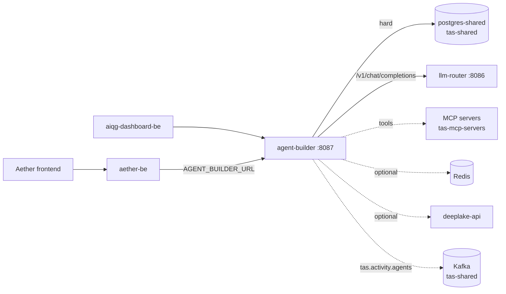

# TAS Agent Builder

## What this is

A Go service in the Tributary AI Services (TAS) platform that stores AI agent definitions and runs them. An agent here is a database row — a name, a system prompt, a model configuration, and a list of attached skills, a skill being a stored row that names an MCP server and the tool names it exposes. Which skills an agent carries is what decides the tools it is offered and where each call is routed. Calling `POST /api/v1/agents/:id/execute` turns that row plus the caller's input into a chat completion, sends it to the TAS LLM Router, and, when the model asks for a tool, calls out to a Model Context Protocol (MCP) server over HTTP, feeds the result back into the conversation, and loops until the model stops asking or the iteration cap is reached. Since `fbba207` it also emits activity events: creating or executing an agent publishes a fire-and-forget CloudEvents 1.0 message to the Kafka topic `tas.activity.agents` (`events/publisher.go`). That is a side channel for other TAS services — it is not part of any HTTP response, and a publish failure does not fail the request.

Three things it is deliberately not. It is not a model gateway: every provider call goes to the TAS LLM Router at `{ROUTER_BASE_URL}/v1/chat/completions` (`services/impl/router_service_impl.go:93`), so this repository holds no OpenAI or Anthropic credentials and needs none. It is not a workflow engine — multi-step orchestration lives in aether-be (the Go backend serving the Aether web application, and this service's main caller) and Argo Workflows, and an agent execution here is a single request-scoped tool loop. It is not an MCP host or federation gateway: it speaks plain HTTP to individual MCP servers in the `tas-mcp-servers` namespace, discovering tools with `GET {server}/mcp/tools/list` and invoking them with `POST {server}/mcp/tools/call` (`services/impl/mcp_context_impl.go:59`, `services/impl/mcp_context_impl.go:146`). It does not route through the prod-tas-mcp federation server.

## Status & scope

**Cluster state re-verified 2026-09-15. The database and log claims below are carried forward from 2026-08-26 and are marked where they could not be re-checked.**

Deployed and healthy. `Deployment/agent-builder` in namespace `tas-agent-builder` runs 2/2 replicas on image `registry-api.tas.scharber.com/tas-agent-builder:latest`, fronted by `Service/agent-builder` on port 8087. It is ClusterIP only — there is no Ingress, so it is reachable from inside the cluster and from `kubectl port-forward`, not from the public internet.

Activity event publishing is shipped and running, not pending. It is worth saying plainly, because the merge date invites the opposite conclusion: the CloudEvents publisher reached `main` only on 2026-09-12 (`fbba207`), yet it was already deployed before then. The binary in the running pods contains the `CloudEvents publisher enabled` startup string, and the pod environment carries `KAFKA_BROKERS=kafka-shared-0.kafka-shared.tas-shared.svc.cluster.local:9092` from `ConfigMap/agent-builder-config`, so the publisher builds a writer rather than no-opping. The deployment tracks `:latest` with `imagePullPolicy: IfNotPresent` and its containers last started 2026-09-01 — which is the general lesson here: what runs is not pinned to a commit, so read the deployed binary rather than the merge date when you need to know what is live.

> [!UNVERIFIED] That events actually arrive on `tas.activity.agents` was not confirmed. Loki returned no data for this namespace during this refresh — including for startup lines known to be emitted — and `kafka-shared-0` has no Kafka CLI on the paths tried, so neither the topic contents nor a publish-failure log line could be inspected. Publishing is enabled by configuration and present in the binary; end-to-end delivery is untested here.

Deployed but idle. Over the roughly 29 days Loki retains, the only `/api/v1` log lines in this namespace are the two unauthenticated probes made while writing this document; everything else is kubelet health checks. The last row in the execution table is dated 2026-02-07. Treat the service as provisioned and correct rather than load-bearing, and do not infer capacity or latency behaviour from production — there is none to observe.

> [!UNVERIFIED] The idleness paragraph above is carried forward from 2026-08-26 and was not re-checked on 2026-09-15: Loki was unreachable from this environment and the shared database was not queried. Traffic in the intervening three weeks would not have been seen.

Configured callers and observed traffic are two different claims, and only the first is verifiable from this repository. Two services are wired to call this one — aether-be through `AGENT_BUILDER_URL`, and aiqg-dashboard-be, both described under How it fits. That establishes that something is set up to call it, not that anything has. For the second question, on whatever date you are reading this, run the two checks the idleness paragraph was originally based on:

```bash
# 1. Did any request reach the API? Loki retains roughly 29 days.
curl -sG 'https://loki.tas.scharber.com/loki/api/v1/query_range' \
  --data-urlencode 'query={namespace="tas-agent-builder"} |= "/api/v1"' \
  --data-urlencode 'limit=100'

# 2. What was recorded? Note the unqualified schema — not agent_builder.
psql -h postgres-shared.tas-shared -U tasuser -d tas_shared \
  -c 'select created_at, agent_id, status from public.ab_agent_executions
      order by created_at desc limit 10;'
```

Neither was runnable from the environment this refresh ran in — Loki did not respond and `psql` was not installed — so they are given as the check to run, not as captured output. Prefer the first: as the recording gap below explains, internal agent runs never reach `ab_agent_executions`, so an empty table is weaker evidence of idleness than an empty log.

Two kinds of agent appear below and the difference matters for everything that follows. An internal agent has `is_internal = true`, is visible to every authenticated user regardless of who created it, and is served from `/api/v1/agents/internal`; these are the ones seeded by migrations. A user agent belongs to an `owner_id` and is visible only to that owner unless it is published (`services/impl/agent_service_impl.go`).

What is genuinely built and seeded: 16 published internal agents (`Prompt Assistant`, `Notebook Chat Assistant`, `Podcast Producer`, an AI Quality Gateway (AIQG) experiment designer, seven per-dialect query assistants, and others), 2 published user agents, and 5 MCP skills pointing at `context7-mcp`, `paper-search-mcp`, `podcast-mcp`, `sequential-thinking-mcp`, and `napkin-mcp`. The weekly model-migration CronJob is real and has fired: `agent_builder.model_migrations` holds one row rewriting a deprecated `claude-3-haiku-20240307` agent to `claude-haiku-4-5-20251001` on 2026-04-27.

Known gaps, stated plainly rather than left for you to discover:

- **Internal agent runs are not recorded.** `ExecuteInternalAgent` runs the tool loop but never calls `StartExecution`; only `ExecuteAgent` writes execution rows (both in `handlers/agent_handlers.go`). Since internal agents are the seeded majority, the execution and usage-stats tables understate real activity — and as of `fbba207` they emit no `agent.executed` event either, so the Kafka stream inherits the same blind spot.
- **`agent.failed` is declared but never emitted.** `events.Publisher` exposes `PublishFailed` for `com.tas.activity.agent.failed`, and no code calls it; the only two publish call sites in the repository are `PublishCreated` in `CreateAgent` and `PublishExecuted` in `ExecuteAgent`. A consumer of `tas.activity.agents` therefore sees successes only, and the absence of a failure event is not evidence that nothing failed.
- **Nothing flushes the publisher on shutdown.** `main` builds the publisher and wires it in with `SetEventsPublisher`, but never calls `Close()`, so anything still batched when `SIGTERM` arrives is dropped rather than flushed. The writer batches on a 10 ms timer (`events/publisher.go`), which makes that window small rather than absent.
- **No metrics endpoint.** The repository working-notes file (`./CLAUDE.md`) claims Prometheus metrics; `GET /metrics` returns `404 page not found` on a locally built binary at this commit, and no such route is registered in `setupRouter` (`cmd/main.go:212`), whose 24 route registrations are the whole HTTP surface. Observability today is Loki logs only.
- **Three Go packages do not compile** — `test/`, `examples/`, and `scripts/`, which between them hold the entire integration test suite. See the test output below.
- **`k8s/secret.yaml` contains literal credential values in Git**, including a real-looking `JWT_SECRET`. Rotate before treating the checked-in manifest as deployable.

## Quick start

The repository no longer builds standalone. `fbba207` added `replace github.com/Tributary-ai-services/aether-shared/go-events => ../aether-shared/go-events` to `go.mod`, so a clone without the `aether-shared` repository checked out beside it does not compile:

```console
$ ls -d ../aether-shared
ls: cannot access '../aether-shared': No such file or directory

$ go build ./cmd/...
events/publisher.go:12:2: github.com/Tributary-ai-services/aether-shared/go-events@v0.0.0-00010101000000-000000000000: replacement directory ../aether-shared/go-events does not exist
exit=1
```

The same error repeats once per import of that module, four in total. The fix is to clone `aether-shared` from `https://github.com/Tributary-ai-services/aether-shared.git` next to this repository, so that both share a parent directory — the replace path is relative, so a checkout anywhere else will not resolve however the module is named. With that in place the build succeeds. The container build satisfies the requirement a different way, and the two are worth not confusing: `build-and-push.sh` copies `../aether-shared/go-events` into the build context, and the `Dockerfile` then rewrites the replace directive to the in-container path `/go-events` with `sed` before `go mod download`. A plain `docker build .` skips that copy and fails.

You need Go 1.23 or newer (`go.mod` pins `go 1.23.0`, toolchain `go1.24.4`), a PostgreSQL you can write to, and `psql` on your shell path if you intend to use `make db-migrate-up` — `database/migrate.sh` shells out to `psql` and exits immediately without it. The build target compiles only the server entry point, which matters because the repository-wide build does not succeed:

```console
$ make build
go build -o agent-builder cmd/main.go

$ go build ./cmd/... ; echo "exit=$?"
exit=0

$ go build ./... ; echo "exit=$?"
scripts/create_tables.go:11:6: main redeclared in this block
	scripts/apply_migration.go:12:6: other declaration of main
examples/reliability_agent_demo.go:19:6: main redeclared in this block
	examples/hello_agent.go:19:6: other declaration of main
examples/hello_agent.go:74:16: cannot use userID (variable of array type uuid.UUID) as string value in struct literal
exit=1
[per-package header lines elided; the full output adds two more redeclarations
 in scripts/, seven more in examples/, and two more type errors in
 hello_agent.go before stopping at "too many errors"]
```

`examples/` and `scripts/` each hold several `package main` files in one directory. Every `make` target that runs `go run scripts/...` — `test-comprehensive`, `test-unit`, `test-reliability`, `example-router` — is broken by this and has been since before this refresh. Use `make build` rather than `go build ./...`, and ignore the sample programs until someone splits them into their own directories.

Two dependencies are worth starting before the service rather than after. PostgreSQL is required and the process exits without it. The TAS LLM Router is not required to start, so you can bring the service up, browse agents and skills, and only discover the router is missing when you try to execute something.

Bring up a database and create the schema. The service auto-migrates its tables but does not create the schema that holds them, so starting against an empty database fails on the first migration:

```console
$ docker run -d --name ab-pg -e POSTGRES_USER=tasuser -e POSTGRES_PASSWORD=taspassword \
    -e POSTGRES_DB=tas_shared -p 15432:5432 postgres:15-alpine

$ DB_HOST=localhost DB_PORT=15432 DB_PASSWORD=taspassword JWT_SECRET=local-dev-secret ./agent-builder
ERROR: schema "agent_builder" does not exist (SQLSTATE 3F000)
2026/08/26 13:32:33 Failed to migrate database:ERROR: schema "agent_builder" does not exist (SQLSTATE 3F000)
```

Apply `database/migrations/000_create_schema.sql` first — through `make db-migrate-up` if you have `psql`, or straight into the container if you do not:

```console
$ docker exec -i ab-pg psql -U tasuser -d tas_shared < database/migrations/000_create_schema.sql
CREATE SCHEMA
GRANT
GRANT
COMMIT
```

Now it starts. Redis is optional and its absence is logged, not fatal — note that setting `REDIS_HOST=` to an empty string does **not** disable it, because `config.LoadConfig` treats an empty value as unset and falls back to `localhost` (`config/config.go:225`):

```console
$ DB_HOST=localhost DB_PORT=15432 DB_PASSWORD=taspassword JWT_SECRET=local-dev-secret \
    SERVER_PORT=8087 MCP_ENABLED=false ./agent-builder
redis: pool.go:426: redis: connection pool: failed to dial after 5 attempts: dial tcp 127.0.0.1:6379: connect: connection refused
2026/08/26 13:36:22 Warning: Redis connection failed, memory service will be disabled: dial tcp 127.0.0.1:6379: connect: connection refused
2026/08/26 13:36:22 Memory service disabled (no Redis connection)
2026/08/26 13:36:22 MCP context service disabled
2026/08/26 13:36:22 [SKILLS] Default skill "visual_generation" already exists, skipping
2026/08/26 13:36:22 Agent Builder server starting on 0.0.0.0:8087
```

`MCP_ENABLED=false` there is convenience, not a requirement. Left at its default of `true` the server starts identically — `NewMCPContextService` constructs the client without contacting anything — and logs `MCP context service initialized: server=http://napkin-mcp.tas-mcp-servers.svc.cluster.local:8087`. That address is unreachable from a laptop, so the difference appears only when an agent actually calls a tool, not at startup.

Health needs no credential. Everything under `/api/v1` does, and this is the first wall you will hit:

```console
$ curl -sS http://localhost:8087/health
{"service":"agent-builder","status":"healthy","timestamp":"2026-08-26T13:36:27.619420941-10:00"}

$ curl -sS -w '\nHTTP %{http_code}\n' http://localhost:8087/api/v1/agents
{"error":"Authorization header required"}
HTTP 401

$ curl -sS -H "Authorization: Bearer not-a-real-token" -w '\nHTTP %{http_code}\n' \
    http://localhost:8087/api/v1/agents
{"error":"Invalid or expired token"}
HTTP 401
```

### Authentication

In the cluster the credential is a Keycloak access token from the `aether` realm. The validator reads the token's `iss` claim, fetches that realm's signing keys from `{iss}/protocol/openid-connect/certs`, and rejects any issuer outside the five allowed in the `auth.NewJWTValidator` call in `setupRouter` (`cmd/main.go:246`) — the three `aether` realm issuers plus two legacy `master` realm entries. Tokens come from whatever already holds a user session: the Aether frontend, or aether-be proxying on a user's behalf. There is no service-account client for this API; both a password grant with the `aether-frontend` dev credentials in `Secret/aether-frontend-dev-credentials` (namespace `aether-be`) and a client-credentials grant with `aether-backend` were rejected by Keycloak on 2026-08-26, so an authenticated call against the deployed instance is not captured here.

Locally you do not need Keycloak at all. The same validator accepts a token signed with the shared secret in `JWT_SECRET` provided the token still claims an allowed issuer and carries a `kid` header (`auth/jwt.go:107`). That is what makes the API exercisable on a laptop, and it is also worth knowing as an operator: anyone holding the production `JWT_SECRET` can mint a token that passes as any Keycloak user, so restrict that secret accordingly.

`ValidateToken` in `auth/jwt.go` enforces four things, and a token missing any of them is rejected:

- **`alg` must be `HS256` locally.** The validator branches on signing method: an RSA-signed token is checked against the issuer's published signing keys, a token signed with a hash-based message authentication code (HMAC) against `JWT_SECRET` directly. Any other method is refused as `unexpected signing method`.
- **A `kid` header must be present.** It is read before the algorithm branch, so an HMAC token needs one even though nothing looks it up in that case. The value is arbitrary locally; `local` works.
- **`iss` must match the allowed list exactly.** The five accepted strings are `https://keycloak.tas.scharber.com/realms/aether`, `http://tas-keycloak-shared:8080/realms/aether`, `http://localhost:8081/realms/aether`, and the `master`-realm equivalents of the last two. Use `http://localhost:8081/realms/aether`. Nothing needs to be listening there — for an HMAC token the issuer is compared as a string, never fetched.
- **`exp` must be in the future.** `sub` is not required to pass validation, but it becomes the user ID, and the tenant is derived from it as `tenant_` followed by its first ten characters (`ExtractUserContext`), so omitting it attributes the call to an empty user.

That is enough to mint one with `openssl` alone:

```bash
b64url() { openssl base64 -e -A | tr '+/' '-_' | tr -d '='; }
header='{"alg":"HS256","typ":"JWT","kid":"local"}'
payload='{"iss":"http://localhost:8081/realms/aether","sub":"11111111-1111-1111-1111-111111111111","exp":'$(( $(date +%s) + 3600 ))'}'
h=$(printf '%s' "$header"  | b64url)
p=$(printf '%s' "$payload" | b64url)
sig=$(printf '%s' "$h.$p" | openssl dgst -sha256 -hmac 'local-dev-secret' -binary | b64url)
token="$h.$p.$sig"
```

```console
$ curl -sS -H "Authorization: Bearer $token" -w '\nHTTP %{http_code}\n' \
    http://localhost:8087/api/v1/agents
{"agents":[],"total":0,"page":1,"size":20}
HTTP 200

$ curl -sS -H "Authorization: Bearer $token" http://localhost:8087/api/v1/skills
{"skills":[{"id":"39462b4a-bac3-42cc-9acf-dd7cb6364562","name":"context7_docs",
"display_name":"Library Docs","type":"mcp",
"mcp_server_url":"http://context7-mcp.tas-mcp-servers.svc.cluster.local:8000",
"mcp_tool_names":["resolve-library-id","query-docs"],"is_public":true,"is_system":true, ...
```

`$token` above was a locally minted JSON Web Token (JWT) signed with `local-dev-secret`, the value passed as `JWT_SECRET` when starting the server; the response bodies are verbatim.

When it does not work, the client cannot tell you why. A missing `kid`, a disallowed issuer and a wrong secret all return the same body, and the distinguishing message is only in the server log:

```console
$ curl -sS -o /dev/null -w 'HTTP %{http_code}\n' -H "Authorization: Bearer $token" \
    http://localhost:8087/api/v1/agents
HTTP 401

# ...meanwhile, in the server's stdout:
2026/09/15 04:21:29 Token validation failed: invalid issuer: https://keycloak.tas.scharber.com/realms/master
2026/09/15 04:21:29 Token validation failed: failed to parse token: token is unverifiable: error while executing keyfunc: token missing kid header
```

Those two lines are the two mistakes worth recognising. The first is a token minted for `https://keycloak.tas.scharber.com/realms/master` — the production host is allowed, but only paired with the `aether` realm, and `master` is accepted only on the two internal hosts. The second is a token with no `kid`. Both look identical from the client, so when a token is refused, read the service log rather than the response body. To reach the deployed instance instead, `kubectl port-forward -n tas-agent-builder svc/agent-builder 18087:8087` and use a real Keycloak token.

Twenty-four routes are registered at startup, all but `/health` behind the auth middleware: agent create/list/get/update/delete plus publish, unpublish, duplicate and execute; the parallel `/api/v1/agents/internal` trio for seeded system agents; skill create/list/get/update/delete; `/api/v1/router/providers` and `/api/v1/router/providers/:provider/models`, which proxy through to the LLM Router; and four singletons — `agent-reliability-metrics`, `validate-agent-config`, `agent-config-templates`, and `stats/user`.

### Tests

`make test` runs `go test -v ./...` and fails, because three packages do not compile. This pre-dates the current documentation refresh — the working tree was clean at `fbba207` when this was captured, and no code was changed:

```console
$ go test ./... ; echo "exit=$?"
?   	github.com/tas-agent-builder/auth	[no test files]
?   	github.com/tas-agent-builder/cmd	[no test files]
?   	github.com/tas-agent-builder/cmd/model-migrate	[no test files]
?   	github.com/tas-agent-builder/config	[no test files]
?   	github.com/tas-agent-builder/events	[no test files]
FAIL	github.com/tas-agent-builder/examples [build failed]
?   	github.com/tas-agent-builder/handlers	[no test files]
?   	github.com/tas-agent-builder/models	[no test files]
FAIL	github.com/tas-agent-builder/scripts [build failed]
?   	github.com/tas-agent-builder/services	[no test files]
ok  	github.com/tas-agent-builder/services/impl	(cached)
ok  	github.com/tas-agent-builder/services/memory	(cached)
FAIL	github.com/tas-agent-builder/test [build failed]
exit=1
```

The `test/` package failure is interface drift, not flakiness — its mocks were written against older signatures:

```console
test/agent_handlers_reliability_test.go:103:33: cannot use mockAgentService (variable of type
  *MockAgentService) as services.AgentService value in argument to handlers.NewAgentHandlers:
  *MockAgentService does not implement services.AgentService (wrong type for method CreateAgent)
		have CreateAgent(context.Context, models.CreateAgentRequest, uuid.UUID, string) (*models.Agent, error)
		want CreateAgent(context.Context, models.CreateAgentRequest, string, string) (*models.Agent, error)
test/agent_handlers_reliability_test.go:103:51: cannot use mockRouterService (variable of type
  *MockRouterService) as services.RouterService value: missing method SendRequestWithTools
```

What does pass: `services/impl` and `services/memory`, covering hybrid context assembly and the three-tier memory implementation. Everything else in `test/` — lifecycle, execution engine, document context, space isolation, load — is currently uncompiled and therefore unmeasured, whatever `TEST_EXECUTION_SUMMARY.md` and its sibling planning documents claim. The `events` package added by `fbba207` ships with no test file either, although `NewWithWriter` exists in it to make the Kafka writer injectable for exactly that purpose (`events/publisher.go`).

## How it fits



One hard dependency: PostgreSQL. `main` connects through `initDB` and then runs `db.AutoMigrate` before anything else (`cmd/main.go`), and both call `log.Fatal` on failure, so the process exits rather than starting degraded. The deployment reinforces this with a `wait-for-postgres` init container that blocks on `nc -z postgres-shared.tas-shared 5432` (`k8s/deployment.yaml`). Everything else is soft. Redis failure logs a warning and disables the memory service and context cache. deeplake-api is what lets an agent answer from documents rather than from its prompt alone: when an agent has knowledge enabled and notebooks attached, the query goes to `{DEEPLAKE_BASE_URL}/api/v1/datasets/{dataset}/search/text` authenticated with an `Authorization: ApiKey` header, and the chunks that come back are injected into the system prompt (`RetrieveVectorContext` in `services/impl/document_context_impl.go`). A failure there does not fail the execution: the error is logged as `Error retrieving document context`, recorded in the response metadata as `context_error`, and the agent falls back to its static system prompt. An unreachable DeepLake therefore costs document grounding rather than availability — the agent still answers, with less to go on, and the only signal is that metadata field. LLM Router failure is not detected at boot at all — it surfaces per request, at execution time. MCP failure is per tool call, and what that means in practice is the next two paragraphs. Kafka is the weakest dependency of the set: `events.New` builds a writer without contacting a broker, so an unreachable or misspelled broker is never detected at startup and surfaces only as `agent-builder events: publish ... failed` log lines, with the originating request still returning success.

Outbound tool calls carry no credential. `InvokeTool` sets `Content-Type`, and `X-Tenant-ID` when a tenant is known; it sets no `Authorization` header, no shared secret and no client certificate, and the same is true of the tool-discovery call (`services/impl/mcp_context_impl.go`). The MCP servers it reaches are ClusterIP services inside `tas-mcp-servers`, so what is being relied on is the cluster network boundary, not authentication: anything that can reach those addresses can invoke the same tools. Tool output is then attached to the conversation marked `trust: pre_scanned`, and that marker is not inert: it is read downstream by the LLM Router's gatekeeper, whose default scan policy always scans `user` messages, never scans `assistant` messages, and skips every other role — `system` and `tool` included — when `trust` equals `pre_scanned` (`internal/gatekeeper/gatekeeper.go` in tas-llm-router). Marking tool output pre-scanned therefore exempts it from the router's compliance scan, on the in-code reasoning that MCP output comes from internal TAS services already scanned at ingestion. That is worth knowing before pointing a skill at a server that is not one of those, because its output will reach the model without being scanned. Retrieved document chunks are marked the same way, with `scan_source: deeplake`.

A failing tool does not abort the execution and is never retried. The error text is written into the tool result instead — `Error invoking tool: ...` when the call itself fails, `Tool error: ...` when the server answers with `isError` — appended to the conversation as a `role: "tool"` message and handed back to the model on the next iteration, leaving the model to decide whether to retry, try another tool, or answer anyway. Only a failure of the LLM call itself ends the loop early, as `[MCP-TOOLS] iteration N failed`. Otherwise the loop runs up to `MCP_MAX_TOOL_ITERATIONS` times and returns the last response when it hits the cap.

Its tables are split across two schemas, which the previous version of this file got wrong. Agents and skills live in the namespaced schema (`agent_builder.agents`, `agent_builder.skills`, plus `agent_builder.model_migrations`), but executions and usage statistics do not: their `TableName()` methods return unqualified names (`models/execution.go:155`, `models/usage_stats.go:92`), so the object-relational mapper (GORM) creates them in the default search path as `public.ab_agent_executions` and `public.ab_agent_usage_stats`. Both spellings exist in the shared database today. Anyone writing a query or a retention policy against `agent_builder.*` alone will miss the execution history entirely.

Two callers are configured for it. aether-be proxies its agent endpoints here via `AGENT_BUILDER_URL`, set to `http://agent-builder.tas-agent-builder:8087/api/v1` in its ConfigMap, and aiqg-dashboard-be defaults to the same host and port. One stale reference is worth knowing about before you debug a connection refused: `aether-be/internal/services/argo_generator.go:771` hardcodes `http://agent-builder.tas-agent-builder.svc.cluster.local:8083`, and nothing has listened on 8083 — the Service and container both use 8087.

## Configuration

Everything is read from the environment through `config.LoadConfig` (`config/config.go:108`); there is no config file. In the cluster, non-secret values come from `ConfigMap/agent-builder-config` and credentials from `Secret/agent-builder-secret`, both in namespace `tas-agent-builder`, mounted wholesale with `envFrom`. `.env.example` is the local template. Two behaviours are worth knowing before you debug a value that will not take: an empty string is treated as unset and falls back to the default, and `validateConfig` refuses to start if `JWT_SECRET` is still the literal placeholder shipped in the code.

The settings that change behaviour, with the code default first and the deployed value where it differs:

| Setting | Code default | Deployed value | Effect |
|---|---|---|---|
| `SERVER_PORT` | `8080` | `8087` | Listen port. The default is not what runs; the Service, both probes, and every caller assume 8087. |
| `ROUTER_BASE_URL` | `http://localhost:8081` | `http://llm-router.tas-llm-router:8086` | Where chat completions go. Wrong here means every execution fails, but startup still succeeds. |
| `ROUTER_MAX_RETRIES` | `3` | `3` | Retry budget for router calls, including model fallback on a deprecated model. |
| `MCP_ENABLED` | `true` | `true` | Master switch for the tool loop. With it off, agents answer from the prompt alone. |
| `MCP_SERVER_URL` | `napkin-mcp…:8087` | same | Fallback MCP server used when an agent has no skills attached. Per-skill URLs in the database take precedence. |
| `MCP_MAX_TOOL_ITERATIONS` | `10` | `10` | Cap on model/tool round trips in one execution. |
| `AETHER_BE_MCP_URL` | `aether-backend…/api/v1/mcp` | unset, so default | Proxy used only when a skill carries both a server ID and a connection ID, for user-authorized connections. |
| `ROUTER_TIMEOUT` | `30` | `30` | Seconds before a non-streaming chat-completion call to the router is abandoned. Streaming calls use a separate client with no total timeout, deliberately — a whole-request deadline would cut off a long generation mid-flight. |
| `MCP_TIMEOUT` | `120` | `120` | Seconds allowed for a single MCP call, four times the router budget. No rationale for the difference is recorded in the code or commit history. |
| `DEEPLAKE_BASE_URL` | `http://localhost:8000` | `http://deeplake-api.aether-be:8000` | Vector search endpoint for document context, with `DEEPLAKE_TIMEOUT` at `30` seconds and `DEEPLAKE_DEFAULT_DATASET` at `documents` in both places. Unreachable means answers without document grounding, not a failed execution. |
| `KAFKA_BROKERS` | unset | `kafka-shared-0.kafka-shared.tas-shared…:9092` | Comma-separated broker list, read straight from `os.Getenv` rather than through `config.LoadConfig`. Unset leaves the publisher nil and every publish call a no-op. It is absent from `.env.example`, so a local run emits nothing unless you set it by hand. |
| `REDIS_HOST` | `localhost` | unset in the ConfigMap | Unset means `localhost`, which in-cluster means no Redis and a warning at boot. |
| `DB_HOST` / `DB_PORT` / `DB_USER` / `DB_NAME` | `localhost` / `5432` / `tasuser` / `tas_shared` | `postgres-shared.tas-shared` / `5432` / from the Secret / `tas_shared` | The one dependency that must resolve for the process to start. `DB_USER` defaults to `tasuser`, which is why the quick start omits it and the container above is created with `POSTGRES_USER=tasuser`; in the cluster it comes from `Secret/agent-builder-secret` rather than the ConfigMap. |

Secrets by location. `Secret/agent-builder-secret` in namespace `tas-agent-builder` holds exactly five keys: `DB_USER`, `DB_PASSWORD`, `JWT_SECRET`, `ROUTER_API_KEY`, and `DEEPLAKE_API_KEY`. `ROUTER_API_KEY` is optional — `validateConfig` deliberately does not require it, and the client omits the `Authorization` header when it is empty (`services/impl/router_service_impl.go:103`). No provider credential belongs in this service; OpenAI and Anthropic keys live with the LLM Router. Read values with `kubectl get secret agent-builder-secret -n tas-agent-builder`, never from the checked-in `k8s/secret.yaml`, whose literal values should be treated as compromised and rotated.

## Where to go next

- [Repository working notes](./CLAUDE.md) — working notes for this repository, including deployment steps for seeding new internal agents. Read it with the corrections in Status & scope above in mind; its Prometheus metrics claim does not hold.
- [`docs/capabilities.md`](docs/capabilities.md) — the platform-level design this service is a slice of, useful for understanding intent rather than current behaviour.
- [`docs/agent-builder-implementation-design.md`](docs/agent-builder-implementation-design.md) — the original implementation design, including the argument for extending aether-be rather than standing this up separately.
- [`database/migrations/`](database/migrations/) — the authoritative record of what is seeded. Each `*_seed_*.sql` file is one internal agent; reading them is the fastest way to see what the shipped agents actually do.
- [`k8s/`](k8s/) — Kustomize manifests for the deployment, service, config, secret, and the weekly model-migration CronJob.
- `aether-shared/go-events/` in the monorepo — the shared CloudEvents module this repository now builds against. `payloads/agent.go` defines the three `com.tas.activity.agent.*` types and their fields; `topics/topics.go` defines the `tas.activity.agents` topic name.
- `aether-shared/data-models/tas-agent-builder/` in the monorepo — entity, API, and schema documentation for the data contracts this service exposes.
- Logs: Grafana Explore against Loki with `{namespace="tas-agent-builder"}`. There is no dashboard and no metrics scrape for this service.

There is no ops document or dev document for this repository yet, and no OpenAPI specification — the route list above and `setupRouter` in `cmd/main.go` are the current API surface of record.
