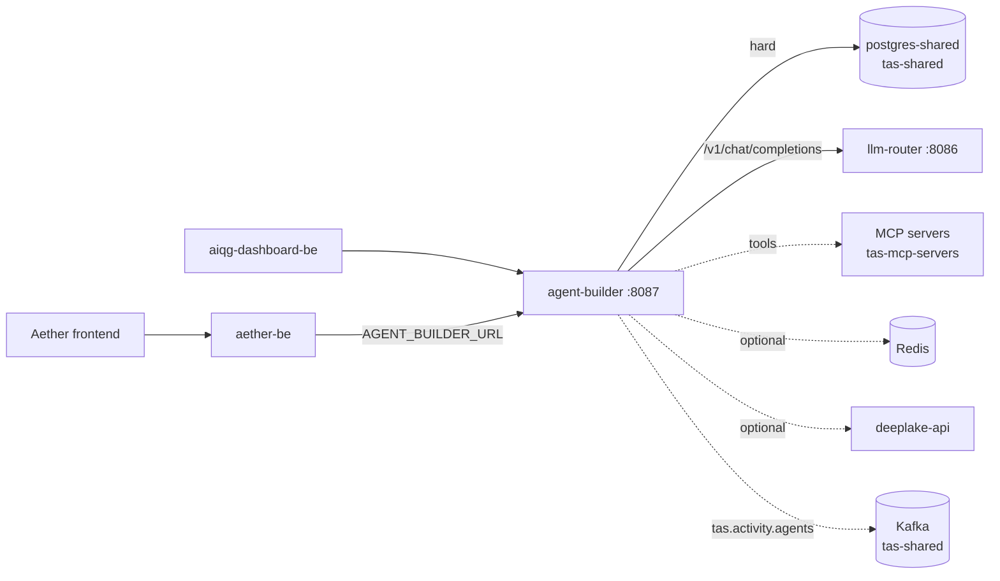

# TAS Agent Builder

## What this is

A Go service in the Tributary AI Services (TAS) platform that stores AI agent definitions and runs them. An agent here is a database row — a name, a system prompt, a model configuration, and a list of attached skills, a skill being a stored row that names a Model Context Protocol (MCP) server and the tool names it exposes. Calling `POST /api/v1/agents/:id/execute` turns that row plus the caller's input into a chat completion, sends it to the TAS LLM Router, and, when the model asks for a tool, calls out to an MCP server over HTTP, feeds the result back into the conversation, and loops until the model stops asking or the iteration cap is reached.

Since `acd03a7` the code also emits activity events: creating an agent or executing a user agent publishes a CloudEvents 1.0 message (the Cloud Native Computing Foundation's event-envelope format) to the Kafka topic `tas.activity.agents` (`events/publisher.go:44`). That is a side channel for other TAS services. It is not part of any HTTP response, and a failed publish does not fail the request. Whether the deployed build actually emits these events today is a separate question, answered under Status & scope — at the time of writing it does not.

Three things it is deliberately not. It is not a model gateway: every provider call goes to the TAS LLM Router at `{ROUTER_BASE_URL}/v1/chat/completions` (`services/impl/router_service_impl.go:93`), so this repository holds no OpenAI or Anthropic credentials and needs none. It is not a workflow engine — multi-step orchestration lives in aether-be (the Go backend of the Aether web application, and this service's main caller) and Argo Workflows, and an agent execution here is a single request-scoped tool loop. It is not an MCP host or federation gateway: it speaks plain HTTP to individual MCP servers in the `tas-mcp-servers` namespace, discovering tools with `GET {server}/mcp/tools/list` and invoking them with `POST {server}/mcp/tools/call` (`services/impl/mcp_context_impl.go:146`, `services/impl/mcp_context_impl.go:59`). It does not route through the prod-tas-mcp federation server.

## Status & scope

**As of 2026-09-21, verified against the cluster (kubectl, read-only) and Loki. The shared database was not queried this time; claims that depend on it are marked.**

Deployed and healthy. `Deployment/agent-builder` in namespace `tas-agent-builder` runs 2/2 replicas, fronted by `Service/agent-builder` on port 8087. It is ClusterIP only — there is no Ingress, so it is reachable from inside the cluster and from `kubectl port-forward`, not from the public internet. The cluster gained a second node, `pinova01`, on 2026-09-21, and the two replicas now run one per node (`pinova01` and `um773dev`) through a `topologySpreadConstraints` rule with `whenUnsatisfiable: ScheduleAnyway` (`k8s/deployment.yaml`). The comment beside that rule records why it is soft: with two nodes, a hard constraint would leave a replica Pending whenever one node is down.

**The deployed image went backwards on 2026-09-21, and activity events stopped with it.** From 2026-09-01 until 19:07 UTC on 2026-09-21 the pods ran `registry-api.tas.scharber.com/tas-agent-builder:latest`, which contained the publisher: Loki shows `CloudEvents publisher enabled — emitting tas.activity.agents to [kafka-shared-0.kafka-shared.tas-shared.svc.cluster.local:9092]` at each start on 09-01 and 09-17. The replica-spread rollout at 19:07 UTC was applied with `kubectl apply -k k8s/`, as the deployment comment instructs, and `k8s/kustomization.yaml` pins the image to `registry-api.tas.scharber.com/agent-builder:model-fallback-20260427211530` — an April build that predates the publisher. The current pods print neither the `CloudEvents publisher enabled` line nor the `KAFKA_BROKERS unset` line that every post-`acd03a7` binary prints, and their migration log lines cite `/app/cmd/main.go:41`, where the current source has `AutoMigrate` at `cmd/main.go:61`. So the running code is older than the commit this file was verified against, and it publishes nothing. Anyone who re-applies `k8s/` will reproduce this until the pinned tag in `k8s/kustomization.yaml` is updated to a build that contains `acd03a7`.

> [!UNVERIFIED] Whether events reached `tas.activity.agents` during the 09-01 to 09-21 window was not checked. Loki holds no `agent-builder events: publish ... failed` line for that period, which rules out refused connections but not silent loss, and the topic itself was not inspected — that would have needed `kubectl exec` into the Kafka pod, which was outside this refresh's read-only scope.

Deployed but idle. Loki retains this namespace from 2026-08-24; across 2026-08-24 to 2026-09-21 the only `/api/v1` request lines are two unauthenticated probes on 08-26 and three requests on 09-17, all from `127.0.0.1` (a port-forward, not a caller). Everything else is kubelet health checks. Treat the service as provisioned and correct rather than load-bearing, and do not infer capacity or latency behaviour from production — there is none to observe. To repeat the check on the day you read this:

```bash
curl -sS -k -G 'https://loki.tas.scharber.com/loki/api/v1/query_range' \
  --data-urlencode 'query={namespace="tas-agent-builder"} |= "[GIN]" |= "/api/v1"' \
  --data-urlencode 'limit=100'
```

(`-k` because the Loki ingress serves a certificate from the cluster's own certificate authority.) Prefer the log over the execution table: as the recording gap below explains, internal agent runs never write execution rows, so an empty table is weaker evidence of idleness than an empty log.

Two kinds of agent appear below and the difference matters. An internal agent has `is_internal = true`, is visible to every authenticated user, and is served from `/api/v1/agents/internal`; these are seeded by migrations. A user agent belongs to an `owner_id` and is visible only to that owner unless it is published.

What is built and seeded: 16 published internal agents — confirmed on 2026-09-17, when an authenticated list call logged all sixteen by name: `Prompt Assistant`, seven per-dialect query assistants (PostgreSQL, MySQL, MariaDB, SQL Server, SQLite, DuckDB, Neo4j), `Notebook Chat Assistant`, four producer agents (`Outline Creator`, `Q&A Generator`, `Document Summarizer`, `Insights Extractor`), `Podcast Producer`, the `Traffic Explorer Filter Assistant`, and the AI Quality Gateway (AIQG) `Experiment Designer`. Five default MCP skills are seeded at every start and the running pods report them present: `visual_generation`, `sequential_thinking`, `paper_search`, `context7_docs`, and `podcast_production`. The weekly model-migration CronJob `agent-builder-model-migration` (Mondays 04:00 UTC) is real and last completed 2026-09-21.

> [!UNVERIFIED] Carried forward from 2026-08-26 and not re-checked, because the shared database was not queried on 2026-09-21: 2 published user agents exist; the last row in `public.ab_agent_executions` is dated 2026-02-07; and `agent_builder.model_migrations` holds one row rewriting a deprecated `claude-3-haiku-20240307` agent to `claude-haiku-4-5-20251001` on 2026-04-27.

Known gaps, stated plainly rather than left for you to discover:

- **The live Deployment has drifted from Git.** Besides the image, the running pod spec carries inline `env` entries that are not in `k8s/deployment.yaml` and that override the ConfigMap: `ROUTER_BASE_URL` (the `.svc.cluster.local` form), `ROUTER_TIMEOUT=120` rather than the ConfigMap's `30`, `SERVER_READ_TIMEOUT` and `SERVER_WRITE_TIMEOUT` at `120`, three service base URLs, and a literal `DEEPLAKE_API_KEY` value, which puts a credential in the Deployment object rather than in `Secret/agent-builder-secret`. Because they were added outside the kustomization, `kubectl apply -k` leaves them in place. Read them with `kubectl get deploy agent-builder -n tas-agent-builder -o jsonpath='{.spec.template.spec.containers[0].env}'`, and treat the Deployment, not `k8s/`, as the source of truth for what runs.
- **Internal agent runs are not recorded.** `ExecuteInternalAgent` (`handlers/agent_handlers.go:483`) runs the tool loop but never calls `StartExecution`; only `ExecuteAgent` (`handlers/agent_handlers.go:1034`) writes execution rows. Since internal agents are the seeded majority, the execution and usage-stats tables understate real activity. They emit no `agent.executed` event either — the only publish call sites are `CreateAgent` (`handlers/agent_handlers.go:123`) and `ExecuteAgent` (`handlers/agent_handlers.go:1297`) — so the Kafka stream inherits the same blind spot.
- **`agent.failed` is declared but never emitted.** `events.Publisher` has `PublishFailed` (`events/publisher.go:91`) and nothing calls it. A consumer of `tas.activity.agents` sees successes only.
- **Nothing flushes the publisher on shutdown.** `main` wires it in with `SetEventsPublisher` (`cmd/main.go:154`) and on `SIGTERM` shuts down the HTTP server, but never calls the publisher's `Close()`.
- **No metrics endpoint.** The repository working-notes file (`./CLAUDE.md`) claims Prometheus metrics; `GET /metrics` returns `404` on a locally built binary at this commit, and no such route is registered in `setupRouter` (`cmd/main.go:212`). Observability today is Loki logs only.
- **Three Go packages do not compile** — `test/`, `examples/`, and `scripts/`, which between them hold the entire integration test suite. See the test output below.
- **The replica on `pinova01` logs `failed to create fsnotify watcher: too many open files` continuously** — over 3,000 lines between 19:07 and 20:56 UTC on 2026-09-21, and none from the replica on `um773dev`. This repository does not depend on fsnotify, so the source is not this service's code.

> [!UNVERIFIED] The fsnotify lines are attributed to the `agent-builder` container of pod `agent-builder-6cf987b78f-kw4xm` by Loki's labels, but where they originate and whether they affect that replica were not established. A node-level inotify limit on the newly added `pinova01` is the likely cause; confirm with the node's `fs.inotify.max_user_instances` before relying on this.

Resolved since the last version of this file: `k8s/secret.yaml`, which held literal credentials, was deleted from the repository and removed from `k8s/kustomization.yaml` in `34f9cda` (2026-09-17). `k8s/secret.example.yaml` replaces it as a template with `REPLACE_ME` values, and its header records that the `JWT_SECRET` the old file carried was the one production used and was rotated that day. The live Secret's last modification is a `kubectl-patch` at 2026-09-17T23:23Z, consistent with that rotation. Every value the old file held remains in Git history.

## Quick start

The repository no longer builds on its own. `acd03a7` added `replace github.com/Tributary-ai-services/aether-shared/go-events => ../aether-shared/go-events` to `go.mod`, and without that directory beside the clone the build fails at the first import:

```console
$ ls -d ../aether-shared
ls: cannot access '../aether-shared': No such file or directory

$ go build ./cmd/... ; echo "exit=$?"
events/publisher.go:12:2: github.com/Tributary-ai-services/aether-shared/go-events@v0.0.0-00010101000000-000000000000: replacement directory ../aether-shared/go-events does not exist
[three more identical lines, one per import of the module]
exit=1
```

Clone `https://github.com/Tributary-ai-services/aether-shared.git` next to this repository so both share a parent directory; the replace path is relative, so a checkout anywhere else does not resolve. (The output above was captured in a git worktree nested inside the repository, which is exactly the "anywhere else" case; the build succeeded once the module was resolved.) The container build satisfies the requirement differently: `build-and-push.sh` copies `../aether-shared/go-events` into the build context, and the `Dockerfile` rewrites the replace directive to `/go-events` with `sed` before `go mod download`. A plain `docker build .` skips that copy and fails. Note that `build-and-push.sh` pushes `tas-agent-builder:latest`, while `k8s/kustomization.yaml` deploys the pinned `agent-builder:model-fallback-20260427211530` — a fresh push does not reach the cluster through `kubectl apply -k`.

You need Go 1.23 or newer (`go.mod` pins `go 1.23.0`, toolchain `go1.24.4`; the Dockerfile now builds with `golang:1.24-alpine`), a PostgreSQL you can write to, and `psql` on your shell path if you intend to use `make db-migrate-up` — `database/migrate.sh` shells out to `psql` and exits immediately without it. `make build` compiles only the server entry point, which matters because the repository-wide build does not succeed. It writes `./agent-builder`, a file that is also committed to the repository, so a local build shows up as a modified tracked file in `git status`; do not commit it.

```console
$ make build
go build -o agent-builder cmd/main.go

$ go build ./... ; echo "exit=$?"
scripts/create_tables.go:11:6: main redeclared in this block
	scripts/apply_migration.go:12:6: other declaration of main
examples/reliability_agent_demo.go:19:6: main redeclared in this block
	examples/hello_agent.go:19:6: other declaration of main
examples/hello_agent.go:74:16: cannot use userID (variable of array type uuid.UUID) as string value in struct literal
exit=1
[per-package header lines elided; the full output adds two more redeclarations
 in scripts/, seven more in examples/, and two more type errors in
 hello_agent.go before stopping at "too many errors"]
```

`examples/` and `scripts/` each hold several `package main` files in one directory. Every `make` target that runs `go run scripts/...` — `test-comprehensive`, `test-unit`, `test-reliability`, `example-router` — is broken by this. Use `make build` rather than `go build ./...`, and ignore the sample programs until someone splits them into their own directories.

PostgreSQL is required and the process exits without it. The TAS LLM Router is not required to start, but it is required sooner than you might expect: creating an agent validates the requested provider against the router, so with no router reachable `POST /api/v1/agents` fails with `400` and `router validation failed: failed to get available providers`. Listing agents and skills works without it.

Bring up a database and create the schema. The service auto-migrates its tables but does not create the schema that holds them, so starting against an empty database fails on the first migration:

```console
$ docker run -d --name ab-pg -e POSTGRES_USER=tasuser -e POSTGRES_PASSWORD=taspassword \
    -e POSTGRES_DB=tas_shared -p 15432:5432 postgres:15-alpine

$ DB_HOST=localhost DB_PORT=15432 DB_PASSWORD=taspassword JWT_SECRET=local-dev-secret ./agent-builder
.../cmd/main.go:61 ERROR: schema "agent_builder" does not exist (SQLSTATE 3F000)
2026/09/21 14:00:48 Failed to migrate database:ERROR: schema "agent_builder" does not exist (SQLSTATE 3F000)
```

`taspassword` there is the throwaway local-container default, not a cluster credential. Apply `database/migrations/000_create_schema.sql` first — through `make db-migrate-up` if you have `psql`, or straight into the container if you do not:

```console
$ docker exec -i ab-pg psql -U tasuser -d tas_shared < database/migrations/000_create_schema.sql
BEGIN
CREATE SCHEMA
GRANT
GRANT
GRANT
GRANT
ALTER DEFAULT PRIVILEGES
ALTER DEFAULT PRIVILEGES
COMMIT
```

Now it starts. Redis is optional and its absence is logged, not fatal — setting `REDIS_HOST=` to an empty string does **not** disable it, because `config.LoadConfig` treats an empty value as unset and falls back to `localhost` (`config/config.go:225`). Kafka is optional too, and with `KAFKA_BROKERS` unset the publisher is off:

```console
$ DB_HOST=localhost DB_PORT=15432 DB_PASSWORD=taspassword JWT_SECRET=local-dev-secret \
    SERVER_PORT=8087 MCP_ENABLED=false ./agent-builder
redis: 2026/09/21 14:00:55 pool.go:426: redis: connection pool: failed to dial after 5 attempts: dial tcp 127.0.0.1:6379: connect: connection refused
2026/09/21 14:00:59 Warning: Redis connection failed, memory service will be disabled: dial tcp 127.0.0.1:6379: connect: connection refused
2026/09/21 14:00:59 Memory service disabled (no Redis connection)
2026/09/21 14:00:59 MCP context service disabled
2026/09/21 14:00:59 [SKILLS] Seeded default skill: visual_generation
[four more "Seeded default skill" lines on a fresh database]
2026/09/21 14:00:59 KAFKA_BROKERS unset — agent activity event publishing disabled
2026/09/21 14:00:59 Agent Builder server starting on 0.0.0.0:8087
```

`MCP_ENABLED=false` there is convenience, not a requirement; left at `true`, startup does not contact any MCP server, and the in-cluster default server address (`napkin-mcp.tas-mcp-servers.svc.cluster.local:8087`) is unreachable from a laptop, which surfaces only when an agent calls a tool.

Health needs no credential. Everything under `/api/v1` does, and this is the first wall you will hit:

```console
$ curl -sS http://localhost:8087/health
{"service":"agent-builder","status":"healthy","timestamp":"2026-09-21T14:01:09.91184448-07:00"}

$ curl -sS -w '\nHTTP %{http_code}\n' http://localhost:8087/api/v1/agents
{"error":"Authorization header required"}
HTTP 401

$ curl -sS -H "Authorization: Bearer not-a-real-token" -w '\nHTTP %{http_code}\n' \
    http://localhost:8087/api/v1/agents
{"error":"Invalid or expired token"}
HTTP 401
```

### Authentication

In the cluster the credential is a Keycloak access token from the `aether` realm. The validator reads the token's `iss` claim, fetches that realm's signing keys from `{iss}/protocol/openid-connect/certs`, and rejects any issuer outside the five allowed in the `auth.NewJWTValidator` call (`cmd/main.go:246`): `https://keycloak.tas.scharber.com/realms/aether`, `http://tas-keycloak-shared:8080/realms/aether`, `http://localhost:8081/realms/aether`, and `master`-realm equivalents of the last two only. Tokens come from whatever already holds a user session: the Aether frontend, or aether-be proxying on a user's behalf. There is no service-account client for this API; both a password grant with the `aether-frontend` dev credentials in `Secret/aether-frontend-dev-credentials` (namespace `aether-be`) and a client-credentials grant with `aether-backend` were rejected by Keycloak on 2026-08-26, so an authenticated call against the deployed instance is not captured here.

Locally you do not need Keycloak at all. The same validator accepts a token signed with a hash-based message authentication code (HMAC) using the secret in `JWT_SECRET`, provided the token claims an allowed issuer and carries a `kid` header (`auth/jwt.go:107`). For an HMAC token the issuer is compared as a string and never fetched, so nothing needs to listen on `localhost:8081`. That is what makes the API exercisable on a laptop, and it is also worth knowing as an operator: anyone holding the production `JWT_SECRET` can mint a token that passes as any user. Worse, `exp` is optional — the expiry check runs only when the claim is present (`auth/jwt.go:126`), and a token minted with no `exp` was accepted on 2026-09-21 — so such a token never expires. Restrict that secret accordingly. This mints a working token with `openssl` alone:

```bash
b64url() { openssl base64 -e -A | tr '+/' '-_' | tr -d '='; }
header='{"alg":"HS256","typ":"JWT","kid":"local"}'
payload='{"iss":"http://localhost:8081/realms/aether","sub":"11111111-1111-1111-1111-111111111111","exp":'$(( $(date +%s) + 3600 ))'}'
h=$(printf '%s' "$header"  | b64url)
p=$(printf '%s' "$payload" | b64url)
sig=$(printf '%s' "$h.$p" | openssl dgst -sha256 -hmac 'local-dev-secret' -binary | b64url)
token="$h.$p.$sig"
```

`sub` becomes the user ID, and the tenant is derived from it as `tenant_` plus its first ten characters (`auth/jwt.go:157`).

```console
$ curl -sS -H "Authorization: Bearer $token" -w '\nHTTP %{http_code}\n' \
    http://localhost:8087/api/v1/agents
{"agents":[],"total":0,"page":1,"size":20}
HTTP 200

$ curl -sS -H "Authorization: Bearer $token" http://localhost:8087/api/v1/skills
{"skills":[{"id":"bca0f22e-2ebf-41d7-a088-bea68b232f45","name":"context7_docs","display_name":"Library Docs",
"description":"Look up programming library documentation and code examples for any framework or package",
"type":"mcp","icon":"Code", ...
```

When a token is refused, the client cannot tell you why — every case returns the same `401` body. The reason is only in the server log. These are the lines produced on 2026-09-21 by a token without `kid` and by one issued for the production host's `master` realm, which is not on the allowed list:

```console
2026/09/21 14:01:24 Token validation failed: failed to parse token: token is unverifiable: error while executing keyfunc: token missing kid header
2026/09/21 14:01:24 Token validation failed: invalid issuer: https://keycloak.tas.scharber.com/realms/master
```

To reach the deployed instance instead, `kubectl port-forward -n tas-agent-builder svc/agent-builder 18087:8087` and use a real Keycloak token.

Twenty-four routes are registered at startup, all but `/health` behind the auth middleware: agent create/list/get/update/delete plus publish, unpublish, duplicate and execute; the parallel `/api/v1/agents/internal` trio for seeded system agents; skill create/list/get/update/delete; `/api/v1/router/providers` and `/api/v1/router/providers/:provider/models`, which proxy through to the LLM Router; and four singletons — `agent-reliability-metrics`, `validate-agent-config`, `agent-config-templates`, and `stats/user`.

### Tests

`make test` runs `go test -v ./...` and fails, because three packages do not compile. This pre-dates the current documentation refresh; the tree was clean at `f1eb3b8` when this was captured, with `go-events` resolved:

```console
$ go test ./...
?   	github.com/tas-agent-builder/auth	[no test files]
?   	github.com/tas-agent-builder/cmd	[no test files]
?   	github.com/tas-agent-builder/cmd/model-migrate	[no test files]
?   	github.com/tas-agent-builder/config	[no test files]
?   	github.com/tas-agent-builder/events	[no test files]
FAIL	github.com/tas-agent-builder/examples [build failed]
?   	github.com/tas-agent-builder/handlers	[no test files]
?   	github.com/tas-agent-builder/models	[no test files]
FAIL	github.com/tas-agent-builder/scripts [build failed]
?   	github.com/tas-agent-builder/services	[no test files]
ok  	github.com/tas-agent-builder/services/impl	0.006s
ok  	github.com/tas-agent-builder/services/memory	0.049s
FAIL	github.com/tas-agent-builder/test [build failed]
FAIL
```

The `test/` package failure is interface drift, not flakiness — its mocks were written against older signatures:

```console
test/agent_handlers_reliability_test.go:103:33: cannot use mockAgentService (variable of type
  *MockAgentService) as services.AgentService value in argument to handlers.NewAgentHandlers:
  *MockAgentService does not implement services.AgentService (wrong type for method CreateAgent)
		have CreateAgent(context.Context, models.CreateAgentRequest, uuid.UUID, string) (*models.Agent, error)
		want CreateAgent(context.Context, models.CreateAgentRequest, string, string) (*models.Agent, error)
```

What does pass: `services/impl` and `services/memory`, covering hybrid context assembly and the three-tier memory implementation. Everything else in `test/` — lifecycle, execution engine, document context, space isolation, load — is currently uncompiled and therefore unmeasured, whatever `TEST_EXECUTION_SUMMARY.md` and its sibling planning documents claim. The `events` package has no test file, although `NewWithWriter` exists in it to make the Kafka writer injectable.

## How it fits



One hard dependency: PostgreSQL. `main` connects at `cmd/main.go:55` and auto-migrates at `cmd/main.go:61` before anything else, and both call `log.Fatal` on failure, so the process exits rather than starting degraded. The deployment reinforces this with a `wait-for-postgres` init container that blocks on `nc -z postgres-shared.tas-shared 5432` (`k8s/deployment.yaml`). Everything else is soft. Redis failure logs a warning and disables the memory service and context cache. LLM Router failure is not detected at boot — it surfaces per request, on agent creation (provider validation) and on execution. MCP failure is per tool call.

Kafka is the weakest dependency of the set. `events.New` builds a writer without contacting a broker, so a wrong or unreachable broker is never detected at startup. Each publish is a synchronous write inside the request, bounded by a 2-second write timeout (`events/publisher.go:58`); a failure is logged and the request still succeeds. With `KAFKA_BROKERS` pointed at a closed local port on 2026-09-21, `POST /api/v1/agents` returned `201` in 48 ms and the server logged `agent-builder events: publish com.tas.activity.agent.created failed: dial tcp 127.0.0.1:19092: connect: connection refused`. A broker that drops packets instead of refusing them would cost up to the full timeout per create or execute; that case was not measured.

Its tables are split across two schemas. Agents and skills live in the namespaced schema (`agent_builder.agents`, `agent_builder.skills`, plus `agent_builder.model_migrations`), but executions and usage statistics do not: their `TableName()` methods return unqualified names (`models/execution.go:155`, `models/usage_stats.go:92`), so the object-relational mapper (GORM) creates them in the default search path as `public.ab_agent_executions` and `public.ab_agent_usage_stats`. Anyone writing a query or a retention policy against `agent_builder.*` alone will miss the execution history entirely.

Two callers are configured for it. aether-be proxies its agent endpoints here via `AGENT_BUILDER_URL`, set to `http://agent-builder.tas-agent-builder:8087/api/v1` in `ConfigMap/aether-backend-config` (namespace `aether-be`), and aiqg-dashboard-be defaults to the same host and port (`aiqg-dashboard-be/internal/config/config.go:283`). One stale reference is worth knowing about before you debug a connection refused: `aether-be/internal/services/argo_generator.go:771` hardcodes `http://agent-builder.tas-agent-builder.svc.cluster.local:8083`, and nothing listens on 8083 — the Service and container both use 8087.

## Configuration

Everything is read from the environment, mostly through `config.LoadConfig` (`config/config.go:108`); there is no config file. In the cluster, non-secret values come from `ConfigMap/agent-builder-config` and credentials from `Secret/agent-builder-secret`, both in namespace `tas-agent-builder`, mounted wholesale with `envFrom` — but inline `env` entries on the live Deployment override several of them (see the drift bullet under Status & scope). `.env.example` is the local template. Two behaviours are worth knowing before you debug a value that will not take: an empty string is treated as unset and falls back to the default, and `validateConfig` refuses to start if `JWT_SECRET` is still the literal placeholder shipped in the code.

The settings that change behaviour, with the code default first and the value the running pods actually receive:

| Setting | Code default | Running value (2026-09-21) | Effect |
|---|---|---|---|
| `SERVER_PORT` | `8080` | `8087` | Listen port. The default is not what runs; the Service, both probes, and every caller assume 8087. |
| `ROUTER_BASE_URL` | `http://localhost:8081` | `http://llm-router.tas-llm-router.svc.cluster.local:8086` (inline env; the ConfigMap's short form is overridden) | Where chat completions and provider validation go. Wrong here means creates and executions fail, but startup still succeeds. |
| `ROUTER_TIMEOUT` | `30` | `120` (inline env; ConfigMap says `30`) | Seconds before a non-streaming router call is abandoned. |
| `ROUTER_MAX_RETRIES` | `3` | `3` | Retry budget for router calls, including model fallback on a deprecated model. |
| `MCP_ENABLED` | `true` | `true` | Master switch for the tool loop. With it off, agents answer from the prompt alone. |
| `MCP_SERVER_URL` | `napkin-mcp…:8087` | same | Fallback MCP server used when an agent has no skills attached. Per-skill URLs in the database take precedence. |
| `MCP_MAX_TOOL_ITERATIONS` | `10` | `10` | Cap on model/tool round trips in one execution. |
| `AETHER_BE_MCP_URL` | `aether-backend…/api/v1/mcp` | unset, so default | Proxy used only when a skill carries both a server ID and a connection ID, for user-authorized connections. |
| `KAFKA_BROKERS` | unset | `kafka-shared-0.kafka-shared.tas-shared.svc.cluster.local:9092` | Comma-separated broker list, read with `os.Getenv` in `kafkaBrokersFromEnv` (`cmd/main.go:32`) rather than through `config.LoadConfig`. Unset leaves the publisher nil and every publish a no-op. Absent from `.env.example`. Set in the cluster, but the running image predates the code that reads it. |
| `REDIS_HOST` | `localhost` | unset in the ConfigMap | Unset means `localhost`, which in-cluster means no Redis and a warning at boot — which is what the running pods log. |
| `DB_HOST` / `DB_NAME` | `localhost` / `tas_shared` | `postgres-shared.tas-shared` / `tas_shared` | The one dependency that must resolve for the process to start. |

Secrets by location. `Secret/agent-builder-secret` in namespace `tas-agent-builder` holds exactly five keys: `DB_USER`, `DB_PASSWORD`, `JWT_SECRET`, `ROUTER_API_KEY`, and `DEEPLAKE_API_KEY`. It is created out of band, not from Git; the `kubectl create secret generic` command to recreate it is in the header of `k8s/secret.example.yaml`. `ROUTER_API_KEY` is optional — `validateConfig` deliberately does not require it, and the client omits the `Authorization` header when it is empty (`services/impl/router_service_impl.go:103`). The live Deployment also sets `DEEPLAKE_API_KEY` inline, which takes precedence over the Secret's key of the same name. No provider credential belongs in this service; OpenAI and Anthropic keys live with the LLM Router. Read values from the cluster with `kubectl get secret agent-builder-secret -n tas-agent-builder -o jsonpath='{.data.JWT_SECRET}' | base64 -d`; nothing in the repository holds a current value.

## Where to go next

- [Repository working notes](./CLAUDE.md) — working notes for this repository, including deployment steps for seeding new internal agents. Read it with the corrections in Status & scope in mind; its Prometheus metrics claim does not hold.
- [`docs/capabilities.md`](docs/capabilities.md) — the platform-level design this service is a slice of, useful for understanding intent rather than current behaviour.
- [`docs/agent-builder-implementation-design.md`](docs/agent-builder-implementation-design.md) — the original implementation design, including the argument for extending aether-be rather than standing this up separately.
- [`database/migrations/`](database/migrations/) — the authoritative record of what is seeded. Each `*_seed_*.sql` file is one internal agent; reading them is the fastest way to see what the shipped agents actually do.
- [`k8s/`](k8s/) — Kustomize manifests for the deployment, service, config, and the weekly model-migration CronJob, plus `secret.example.yaml`, the template for the out-of-band Secret. Check the pinned image tag in `kustomization.yaml` before applying.
- `aether-shared/go-events/` in the monorepo — the shared CloudEvents module this repository builds against; it defines the `com.tas.activity.agent.*` event types and the `tas.activity.agents` topic name.
- `aether-shared/data-models/tas-agent-builder/` in the monorepo — entity, API, and schema documentation for the data contracts this service exposes.
- Logs: Grafana Explore against Loki with `{namespace="tas-agent-builder"}`. There is no dashboard and no metrics scrape for this service.

There is no ops document or dev document for this repository yet, and no OpenAPI specification — the route list above and `setupRouter` in `cmd/main.go` are the current API surface of record.
