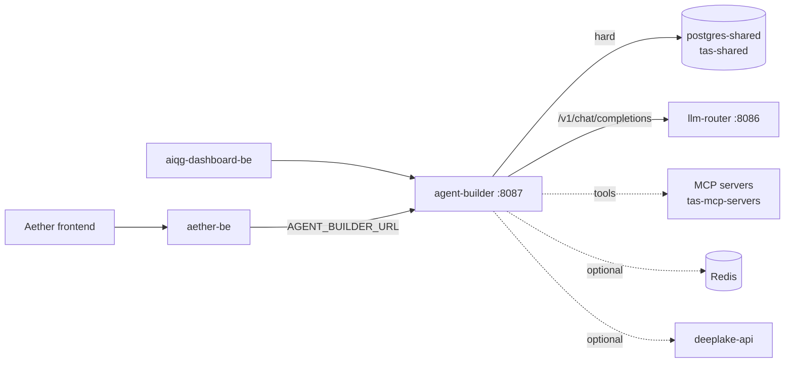

# TAS Agent Builder

## What this is

A Go service that stores AI agent definitions and runs them. An agent here is a database row — a name, a system prompt, a model configuration, and a list of attached skills. Calling `POST /api/v1/agents/:id/execute` turns that row plus the caller's input into a chat completion, sends it to the TAS LLM Router, and, when the model asks for a tool, calls out to a Model Context Protocol (MCP) server over HTTP, feeds the result back into the conversation, and loops until the model stops asking or the iteration cap is reached.

Three things it is deliberately not. It is not a model gateway: every provider call goes to the TAS LLM Router at `{ROUTER_BASE_URL}/v1/chat/completions` (`services/impl/router_service_impl.go:93`), so this repository holds no OpenAI or Anthropic credentials and needs none. It is not a workflow engine — multi-step orchestration lives in aether-be and Argo Workflows, and an agent execution here is a single request-scoped tool loop. It is not an MCP host or federation gateway: it speaks plain HTTP to individual MCP servers in the `tas-mcp-servers` namespace, discovering tools with `GET {server}/mcp/tools/list` and invoking them with `POST {server}/mcp/tools/call` (`services/impl/mcp_context_impl.go:59`, `services/impl/mcp_context_impl.go:146`). It does not route through the prod-tas-mcp federation server.

## Status & scope

**As of 2026-08-26, verified against the cluster and the shared database.**

Deployed and healthy. `Deployment/agent-builder` in namespace `tas-agent-builder` runs 2/2 replicas on image `registry-api.tas.scharber.com/tas-agent-builder:latest`, fronted by `Service/agent-builder` on port 8087. It is ClusterIP only — there is no Ingress, so it is reachable from inside the cluster and from `kubectl port-forward`, not from the public internet.

Deployed but idle. Over the roughly 29 days Loki retains, the only `/api/v1` log lines in this namespace are the two unauthenticated probes made while writing this document; everything else is kubelet health checks. The last row in the execution table is dated 2026-02-07. Treat the service as provisioned and correct rather than load-bearing, and do not infer capacity or latency behaviour from production — there is none to observe.

What is genuinely built and seeded: 16 published internal agents (`Prompt Assistant`, `Notebook Chat Assistant`, `Podcast Producer`, an AI Quality Gateway (AIQG) experiment designer, seven per-dialect query assistants, and others), 2 published user agents, and 5 MCP skills pointing at `context7-mcp`, `paper-search-mcp`, `podcast-mcp`, `sequential-thinking-mcp`, and `napkin-mcp`. The weekly model-migration CronJob is real and has fired: `agent_builder.model_migrations` holds one row rewriting a deprecated `claude-3-haiku-20240307` agent to `claude-haiku-4-5-20251001` on 2026-04-27.

Known gaps, stated plainly rather than left for you to discover:

- **Internal agent runs are not recorded.** `ExecuteInternalAgent` (`handlers/agent_handlers.go:467`) runs the tool loop but never calls `StartExecution`; only `ExecuteAgent` (`handlers/agent_handlers.go:1284`) writes execution rows. Since internal agents are the seeded majority, the execution and usage-stats tables understate real activity.
- **No metrics endpoint.** The repository working-notes file (`./CLAUDE.md`) claims Prometheus metrics; `GET /metrics` returns `404 page not found` on a locally built binary at this commit, and no such route is registered in `cmd/main.go:182`. Observability today is Loki logs only.
- **Three Go packages do not compile** — `test/`, `examples/`, and `scripts/`, which between them hold the entire integration test suite. See the test output below.
- **`k8s/secret.yaml` contains literal credential values in Git**, including a real-looking `JWT_SECRET`. Rotate before treating the checked-in manifest as deployable.

## Quick start

The repository builds standalone. `go.mod` declares no `replace` directives to sibling TAS modules, so a fresh clone compiles without the rest of the monorepo present — unlike several of its neighbours.

You need Go 1.23 or newer (`go.mod` pins `go 1.23.0`, toolchain `go1.24.4`), a PostgreSQL you can write to, and `psql` on your shell path if you intend to use `make db-migrate-up` — `database/migrate.sh` shells out to `psql` and exits immediately without it. The build target compiles only the server entry point, which matters because the repository-wide build does not succeed:

```console
$ make build
go build -o agent-builder cmd/main.go

$ go build ./cmd/... ; echo "exit=$?"
exit=0

$ go build ./... ; echo "exit=$?"
scripts/create_tables.go:11:6: main redeclared in this block
	scripts/apply_migration.go:12:6: other declaration of main
examples/reliability_agent_demo.go:19:6: main redeclared in this block
	examples/hello_agent.go:19:6: other declaration of main
examples/hello_agent.go:74:16: cannot use userID (variable of array type uuid.UUID) as string value in struct literal
exit=1
[per-package header lines elided; the full output adds two more redeclarations
 in scripts/, seven more in examples/, and two more type errors in
 hello_agent.go before stopping at "too many errors"]
```

`examples/` and `scripts/` each hold several `package main` files in one directory. Every `make` target that runs `go run scripts/...` — `test-comprehensive`, `test-unit`, `test-reliability`, `example-router` — is broken by this and has been since before this refresh. Use `make build` rather than `go build ./...`, and ignore the sample programs until someone splits them into their own directories.

Two dependencies are worth starting before the service rather than after. PostgreSQL is required and the process exits without it. The TAS LLM Router is not required to start, so you can bring the service up, browse agents and skills, and only discover the router is missing when you try to execute something.

Bring up a database and create the schema. The service auto-migrates its tables but does not create the schema that holds them, so starting against an empty database fails on the first migration:

```console
$ docker run -d --name ab-pg -e POSTGRES_USER=tasuser -e POSTGRES_PASSWORD=taspassword \
    -e POSTGRES_DB=tas_shared -p 15432:5432 postgres:15-alpine

$ DB_HOST=localhost DB_PORT=15432 DB_PASSWORD=taspassword JWT_SECRET=local-dev-secret ./agent-builder
ERROR: schema "agent_builder" does not exist (SQLSTATE 3F000)
2026/08/26 13:32:33 Failed to migrate database:ERROR: schema "agent_builder" does not exist (SQLSTATE 3F000)
```

Apply `database/migrations/000_create_schema.sql` first — through `make db-migrate-up` if you have `psql`, or straight into the container if you do not:

```console
$ docker exec -i ab-pg psql -U tasuser -d tas_shared < database/migrations/000_create_schema.sql
CREATE SCHEMA
GRANT
GRANT
COMMIT
```

Now it starts. Redis is optional and its absence is logged, not fatal — note that setting `REDIS_HOST=` to an empty string does **not** disable it, because `config.LoadConfig` treats an empty value as unset and falls back to `localhost` (`config/config.go:225`):

```console
$ DB_HOST=localhost DB_PORT=15432 DB_PASSWORD=taspassword JWT_SECRET=local-dev-secret \
    SERVER_PORT=8087 MCP_ENABLED=false ./agent-builder
redis: pool.go:426: redis: connection pool: failed to dial after 5 attempts: dial tcp 127.0.0.1:6379: connect: connection refused
2026/08/26 13:36:22 Warning: Redis connection failed, memory service will be disabled: dial tcp 127.0.0.1:6379: connect: connection refused
2026/08/26 13:36:22 Memory service disabled (no Redis connection)
2026/08/26 13:36:22 MCP context service disabled
2026/08/26 13:36:22 [SKILLS] Default skill "visual_generation" already exists, skipping
2026/08/26 13:36:22 Agent Builder server starting on 0.0.0.0:8087
```

Health needs no credential. Everything under `/api/v1` does, and this is the first wall you will hit:

```console
$ curl -sS http://localhost:8087/health
{"service":"agent-builder","status":"healthy","timestamp":"2026-08-26T13:36:27.619420941-10:00"}

$ curl -sS -w '\nHTTP %{http_code}\n' http://localhost:8087/api/v1/agents
{"error":"Authorization header required"}
HTTP 401

$ curl -sS -H "Authorization: Bearer not-a-real-token" -w '\nHTTP %{http_code}\n' \
    http://localhost:8087/api/v1/agents
{"error":"Invalid or expired token"}
HTTP 401
```

### Authentication

In the cluster the credential is a Keycloak access token from the `aether` realm. The validator reads the token's `iss` claim, fetches that realm's signing keys from `{iss}/protocol/openid-connect/certs`, and rejects any issuer outside the five allowed in `cmd/main.go:216` — the three `aether` realm issuers plus two legacy `master` realm entries. Tokens come from whatever already holds a user session: the Aether frontend, or aether-be proxying on a user's behalf. There is no service-account client for this API; both a password grant with the `aether-frontend` dev credentials in `Secret/aether-frontend-dev-credentials` (namespace `aether-be`) and a client-credentials grant with `aether-backend` were rejected by Keycloak on 2026-08-26, so an authenticated call against the deployed instance is not captured here.

Locally you do not need Keycloak at all. The same validator accepts a token signed with the shared secret in `JWT_SECRET` provided the token still claims an allowed issuer and carries a `kid` header (`auth/jwt.go:107`). That is what makes the API exercisable on a laptop, and it is also worth knowing as an operator: anyone holding the production `JWT_SECRET` can mint a token that passes as any Keycloak user, so restrict that secret accordingly.

```console
$ curl -sS -H "Authorization: Bearer $token" -w '\nHTTP %{http_code}\n' \
    http://localhost:8087/api/v1/agents
{"agents":[],"total":0,"page":1,"size":20}
HTTP 200

$ curl -sS -H "Authorization: Bearer $token" http://localhost:8087/api/v1/skills
{"skills":[{"id":"39462b4a-bac3-42cc-9acf-dd7cb6364562","name":"context7_docs",
"display_name":"Library Docs","type":"mcp",
"mcp_server_url":"http://context7-mcp.tas-mcp-servers.svc.cluster.local:8000",
"mcp_tool_names":["resolve-library-id","query-docs"],"is_public":true,"is_system":true, ...
```

`$token` above was a locally minted JSON Web Token (JWT) signed with `local-dev-secret`, the value passed as `JWT_SECRET` when starting the server; the response bodies are verbatim. To reach the deployed instance instead, `kubectl port-forward -n tas-agent-builder svc/agent-builder 18087:8087` and use a real Keycloak token.

Twenty-four routes are registered at startup, all but `/health` behind the auth middleware: agent create/list/get/update/delete plus publish, unpublish, duplicate and execute; the parallel `/api/v1/agents/internal` trio for seeded system agents; skill create/list/get/update/delete; `/api/v1/router/providers` and `/api/v1/router/providers/:provider/models`, which proxy through to the LLM Router; and four singletons — `agent-reliability-metrics`, `validate-agent-config`, `agent-config-templates`, and `stats/user`.

### Tests

`make test` runs `go test -v ./...` and fails, because three packages do not compile. This pre-dates the current documentation refresh — the working tree was clean at `1cce864` when this was captured, and no code was changed:

```console
$ go test ./... ; echo "exit=$?"
?   	github.com/tas-agent-builder/auth	[no test files]
FAIL	github.com/tas-agent-builder/examples [build failed]
FAIL	github.com/tas-agent-builder/scripts [build failed]
ok  	github.com/tas-agent-builder/services/impl	0.007s
ok  	github.com/tas-agent-builder/services/memory	0.031s
FAIL	github.com/tas-agent-builder/test [build failed]
exit=1
```

The `test/` package failure is interface drift, not flakiness — its mocks were written against older signatures:

```console
test/agent_handlers_reliability_test.go:103:33: cannot use mockAgentService (variable of type
  *MockAgentService) as services.AgentService value in argument to handlers.NewAgentHandlers:
  *MockAgentService does not implement services.AgentService (wrong type for method CreateAgent)
		have CreateAgent(context.Context, models.CreateAgentRequest, uuid.UUID, string) (*models.Agent, error)
		want CreateAgent(context.Context, models.CreateAgentRequest, string, string) (*models.Agent, error)
test/agent_handlers_reliability_test.go:103:51: cannot use mockRouterService (variable of type
  *MockRouterService) as services.RouterService value: missing method SendRequestWithTools
```

What does pass: `services/impl` and `services/memory`, covering hybrid context assembly and the three-tier memory implementation. Everything else in `test/` — lifecycle, execution engine, document context, space isolation, load — is currently uncompiled and therefore unmeasured, whatever `TEST_EXECUTION_SUMMARY.md` and its sibling planning documents claim.

## How it fits



One hard dependency: PostgreSQL. `cmd/main.go:35` connects and `cmd/main.go:41` auto-migrates before anything else, and both call `log.Fatal` on failure, so the process exits rather than starting degraded. The deployment reinforces this with a `wait-for-postgres` init container that blocks on `nc -z postgres-shared.tas-shared 5432` (`k8s/deployment.yaml`). Everything else is soft. Redis failure logs a warning and disables the memory service and context cache. LLM Router failure is not detected at boot at all — it surfaces per request, at execution time. MCP failure is per tool call.

Its tables are split across two schemas, which the previous version of this file got wrong. Agents and skills live in the namespaced schema (`agent_builder.agents`, `agent_builder.skills`, plus `agent_builder.model_migrations`), but executions and usage statistics do not: their `TableName()` methods return unqualified names (`models/execution.go:155`, `models/usage_stats.go:92`), so the object-relational mapper (GORM) creates them in the default search path as `public.ab_agent_executions` and `public.ab_agent_usage_stats`. Both spellings exist in the shared database today. Anyone writing a query or a retention policy against `agent_builder.*` alone will miss the execution history entirely.

Two callers are configured for it. aether-be proxies its agent endpoints here via `AGENT_BUILDER_URL`, set to `http://agent-builder.tas-agent-builder:8087/api/v1` in its ConfigMap, and aiqg-dashboard-be defaults to the same host and port. One stale reference is worth knowing about before you debug a connection refused: `aether-be/internal/services/argo_generator.go:771` hardcodes `http://agent-builder.tas-agent-builder.svc.cluster.local:8083`, and nothing has listened on 8083 — the Service and container both use 8087.

## Configuration

Everything is read from the environment through `config.LoadConfig` (`config/config.go:108`); there is no config file. In the cluster, non-secret values come from `ConfigMap/agent-builder-config` and credentials from `Secret/agent-builder-secret`, both in namespace `tas-agent-builder`, mounted wholesale with `envFrom`. `.env.example` is the local template. Two behaviours are worth knowing before you debug a value that will not take: an empty string is treated as unset and falls back to the default, and `validateConfig` refuses to start if `JWT_SECRET` is still the literal placeholder shipped in the code.

The settings that change behaviour, with the code default first and the deployed value where it differs:

| Setting | Code default | Deployed value | Effect |
|---|---|---|---|
| `SERVER_PORT` | `8080` | `8087` | Listen port. The default is not what runs; the Service, both probes, and every caller assume 8087. |
| `ROUTER_BASE_URL` | `http://localhost:8081` | `http://llm-router.tas-llm-router:8086` | Where chat completions go. Wrong here means every execution fails, but startup still succeeds. |
| `ROUTER_MAX_RETRIES` | `3` | `3` | Retry budget for router calls, including model fallback on a deprecated model. |
| `MCP_ENABLED` | `true` | `true` | Master switch for the tool loop. With it off, agents answer from the prompt alone. |
| `MCP_SERVER_URL` | `napkin-mcp…:8087` | same | Fallback MCP server used when an agent has no skills attached. Per-skill URLs in the database take precedence. |
| `MCP_MAX_TOOL_ITERATIONS` | `10` | `10` | Cap on model/tool round trips in one execution. |
| `AETHER_BE_MCP_URL` | `aether-backend…/api/v1/mcp` | unset, so default | Proxy used only when a skill carries both a server ID and a connection ID, for user-authorized connections. |
| `REDIS_HOST` | `localhost` | unset in the ConfigMap | Unset means `localhost`, which in-cluster means no Redis and a warning at boot. |
| `DB_HOST` / `DB_NAME` | `localhost` / `tas_shared` | `postgres-shared.tas-shared` / `tas_shared` | The one dependency that must resolve for the process to start. |

Secrets by location. `Secret/agent-builder-secret` in namespace `tas-agent-builder` holds exactly five keys: `DB_USER`, `DB_PASSWORD`, `JWT_SECRET`, `ROUTER_API_KEY`, and `DEEPLAKE_API_KEY`. `ROUTER_API_KEY` is optional — `validateConfig` deliberately does not require it, and the client omits the `Authorization` header when it is empty (`services/impl/router_service_impl.go:103`). No provider credential belongs in this service; OpenAI and Anthropic keys live with the LLM Router. Read values with `kubectl get secret agent-builder-secret -n tas-agent-builder`, never from the checked-in `k8s/secret.yaml`, whose literal values should be treated as compromised and rotated.

## Where to go next

- [Repository working notes](./CLAUDE.md) — working notes for this repository, including deployment steps for seeding new internal agents. Read it with the corrections in Status & scope above in mind; its Prometheus metrics claim does not hold.
- [`docs/capabilities.md`](docs/capabilities.md) — the platform-level design this service is a slice of, useful for understanding intent rather than current behaviour.
- [`docs/agent-builder-implementation-design.md`](docs/agent-builder-implementation-design.md) — the original implementation design, including the argument for extending aether-be rather than standing this up separately.
- [`database/migrations/`](database/migrations/) — the authoritative record of what is seeded. Each `*_seed_*.sql` file is one internal agent; reading them is the fastest way to see what the shipped agents actually do.
- [`k8s/`](k8s/) — Kustomize manifests for the deployment, service, config, secret, and the weekly model-migration CronJob.
- `aether-shared/data-models/tas-agent-builder/` in the monorepo — entity, API, and schema documentation for the data contracts this service exposes.
- Logs: Grafana Explore against Loki with `{namespace="tas-agent-builder"}`. There is no dashboard and no metrics scrape for this service.

There is no ops document or dev document for this repository yet, and no OpenAPI specification — the route list above and `cmd/main.go:182` are the current API surface of record.
