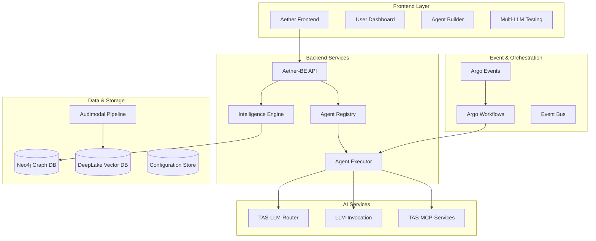
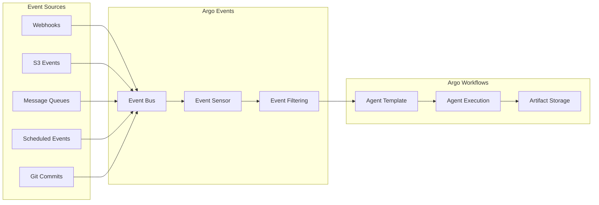

# Comprehensive AI Agent Platform: High-Level Design Document

## Executive Summary

This document outlines the architecture for a comprehensive AI agent builder platform that combines user-friendly agent creation with enterprise-grade execution capabilities. The platform leverages existing infrastructure components while introducing innovative features including AI-assisted agent building, collaborative intelligence through graph relationships, and event-driven orchestration.

**Key Value Propositions:**
- **AI-Assisted Agent Building**: Natural language intent capture with intelligent tool and resource suggestions
- **Collaborative Intelligence**: Neo4j-powered organizational knowledge sharing and pattern recognition
- **Universal Agent Support**: Built-in agents plus external API integration with comprehensive observability
- **Event-Driven Architecture**: Kubernetes-native workflow orchestration via Argo Events and Workflows
- **Enterprise Ready**: Security, compliance, monitoring, and scalability for production deployment

## Comprehensive Capability Requirements

### Core Platform Capabilities ✅

#### 1. Agent Types & Orchestration
**Built-in Agent Types**
- ✅ Q&A Agents (stateless, no memory)
- ✅ Conversational Agents (with memory management)
- ✅ Producer Agents (create artifacts: images, reports, summaries, Q&A, podcasts)
- ✅ Multi-agent workflows (sequential, concurrent, hierarchical)

**Custom Agent Support**
- ✅ External API agents (custom endpoints with credentials)
- ✅ Hybrid agents (built-in + custom logic)
- ✅ Legacy system integration
- ✅ Pluggable agent interface abstraction

**Memory Management**
- ✅ Three-tier architecture (working, short-term, long-term)
- ✅ Cross-session persistence
- ✅ Hierarchical namespace organization
- ✅ Vector-based semantic retrieval
- ✅ Memory optimization strategies

#### 2. Integration & Tool Support
**Vector Search & Knowledge**
- ✅ Audimodal for document processing & vector ingest
- ✅ DeepLake for vector storage & retrieval
- ✅ Notebook concept for knowledge bases
- ✅ Hybrid search (vector + keyword)
- ✅ Multi-modal content processing

**Tool Integration**
- ✅ Vendor-supported tools via TAS-LLM-Router
- ✅ MCP services via TAS-MCP federation and TAS-MCP-Services containers
- ✅ Dynamic tool discovery and capability advertisement
- ✅ Standardized authentication and authorization
- ✅ Tool marketplace and management

**LLM Management**
- ✅ Multi-vendor support via TAS-LLM-Router
- ✅ Intelligent routing and failover
- ✅ Cost-performance optimization
- ✅ A/B testing framework for model selection
- ✅ Streaming responses and rate limit handling

#### 3. User Experience & Collaboration
**AI-Assisted Agent Building**
- ✅ Natural language intent capture
- ✅ Intelligent tool and notebook suggestions
- ✅ Real-time improvement recommendations
- ✅ Multi-LLM comparative testing
- ✅ Progressive disclosure interface (beginner → expert)

**User-Centric Features**
- ✅ Neo4j-powered user relationships
- ✅ Organizational intelligence and team discovery
- ✅ Collaborative agent development
- ✅ Agent sharing with permissions
- ✅ Personal agent dashboard

**Testing & Validation**
- ✅ Side-by-side LLM comparison
- ✅ Isolated testing environments
- ✅ Performance benchmarking
- ✅ Cost analysis per test run
- ✅ Mock data for sensitive testing

### Advanced Enterprise Capabilities ✅

#### 4. Production Operations
**Observability & Monitoring**
- ✅ Comprehensive execution chain visibility
- ✅ Distributed tracing with OpenTelemetry
- ✅ Performance metrics and bottleneck detection
- ✅ Cost tracking and optimization suggestions
- ✅ Real-time health monitoring

**Security & Compliance**
- ✅ Encrypted credential management
- ✅ Role-based access control
- ✅ Audit trails and compliance tracking
- ✅ Data isolation and multi-tenancy
- ✅ SOC 2 compliance preparation

**Scalability & Reliability**
- ✅ Horizontal scaling architecture
- ✅ Circuit breakers and graceful degradation
- ✅ Aggressive caching strategies
- ✅ Error handling and recovery patterns
- ✅ Performance optimization recommendations

#### 5. Event-Driven Orchestration
**Argo Events Integration**
- ✅ Kubernetes-native event processing
- ✅ 20+ event sources (webhooks, S3, Kafka, Git, calendars)
- ✅ CloudEvents specification compliance
- ✅ Sophisticated event filtering and routing
- ✅ Parameter transformation and validation

**Workflow Orchestration**
- ✅ Argo Workflows for execution engine
- ✅ WorkflowTemplate reusability
- ✅ Artifact management and passing
- ✅ Conditional logic and DAG execution
- ✅ Error handling with retry strategies

#### 6. Graph-Powered Intelligence
**Social & Organizational Features**
- ✅ Network-effect learning from successful patterns
- ✅ Team collaboration and knowledge sharing
- ✅ Organizational agent marketplace
- ✅ Expertise-based recommendations
- ✅ Success pattern analysis

**Continuous Learning**
- ✅ Pattern recognition from usage data
- ✅ Automatic improvement suggestions
- ✅ Tool performance correlation analysis
- ✅ User behavior insights
- ✅ Knowledge gap identification

### Technical Architecture Components ✅

#### 7. System Integration
**Frontend (Aether)**
- ✅ Visual agent design interface
- ✅ Drag-and-drop workflow builder
- ✅ Real-time collaboration features
- ✅ Testing and debugging interface
- ✅ User dashboard and agent marketplace

**Backend (Aether-BE)**
- ✅ Agent orchestration engine
- ✅ Memory management service
- ✅ Configuration and deployment management
- ✅ User and permission management
- ✅ Analytics and monitoring APIs

**Specialized Services**
- ✅ TAS-LLM-Router: Intelligent model routing
- ✅ LLM-Invocation: Agent execution runtime
- ✅ Audimodal: Vector processing pipeline
- ✅ DeepLake: Vector storage and retrieval
- ✅ TAS-MCP: MCP server federation
- ✅ TAS-MCP-Services: Containerized MCP deployments

#### 8. Data & Storage
**Neo4j Graph Database**
- ✅ User-agent relationships
- ✅ Tool and notebook associations
- ✅ Success pattern storage
- ✅ Collaboration networks
- ✅ Performance analytics

**Configuration Management**
- ✅ Version control for agent configs
- ✅ Environment-specific deployments
- ✅ Configuration templates and presets
- ✅ Backup and restore capabilities
- ✅ Migration and upgrade paths

### Deployment & Operations ✅

#### 9. Production Readiness
**Deployment Options**
- ✅ Cloud-native architecture
- ✅ On-premises deployment support
- ✅ Hybrid cloud configurations
- ✅ Container orchestration
- ✅ Blue-green deployment strategies

**Monitoring & Alerting**
- ✅ Performance anomaly detection
- ✅ Cost spike alerts
- ✅ Success rate monitoring
- ✅ Capacity planning metrics
- ✅ SLA tracking and reporting

**Developer Experience**
- ✅ Comprehensive API documentation
- ✅ SDK and client libraries
- ✅ Testing frameworks and tools
- ✅ Debugging and troubleshooting guides
- ✅ Community and support resources

### Implementation Priority Matrix

#### Phase 1: Foundation (Months 1-3) 🎯
1. Core agent orchestration with basic types
2. Memory management with DeepLake integration
3. TAS-LLM-Router integration for model management
4. Basic user interface with agent builder
5. Neo4j user-agent relationships

#### Phase 2: Intelligence (Months 4-6) 🧠
1. AI-assisted suggestions and recommendations
2. Multi-LLM testing framework
3. Tool and MCP integration layer
4. Execution chain visibility
5. Basic collaboration features

#### Phase 3: Enterprise (Months 7-9) 🏢
1. Custom agent interfaces and external APIs
2. Comprehensive observability and tracing
3. Security and credential management
4. Performance optimization and scaling
5. Advanced collaboration and marketplace

#### Phase 4: Advanced (Months 10-12) 🚀
1. Producer agents and artifact generation
2. Event-driven orchestration with Argo
3. Advanced analytics and reporting
4. Industry-specific templates and presets
5. AI-powered optimization and auto-tuning

### Success Metrics & KPIs

#### User Experience Metrics
- ✅ Time to first working agent (target: <10 minutes)
- ✅ Agent builder adoption rate
- ✅ User satisfaction scores
- ✅ Collaboration frequency and success

#### Technical Performance Metrics
- ✅ Agent execution latency (95th percentile)
- ✅ System availability and uptime
- ✅ Cost per execution optimization
- ✅ Error rates and recovery times

#### Business Impact Metrics
- ✅ Agent deployment frequency
- ✅ Business process automation success
- ✅ User productivity improvements
- ✅ Platform revenue and growth

### Risk Mitigation Strategies

#### Technical Risks
- ✅ Vendor lock-in prevention through abstraction layers
- ✅ Scalability bottlenecks through microservices architecture
- ✅ Data privacy through encryption and access controls
- ✅ Performance degradation through monitoring and optimization

#### Business Risks
- ✅ User adoption through intuitive UX and AI assistance
- ✅ Competition through unique collaborative features
- ✅ Market changes through flexible architecture
- ✅ Compliance through built-in governance features

## System Overview

### Core Components Architecture



### Technology Stack Integration

| Component | Technology | Purpose |
|-----------|------------|---------|
| **Frontend** | Aether (React/TypeScript) | Visual agent design interface |
| **Backend** | Aether-BE (Python/FastAPI) | Core API and orchestration |
| **Graph Database** | Neo4j | User relationships and collaboration |
| **Vector Storage** | DeepLake | Knowledge base and semantic search |
| **Vector Pipeline** | Audimodal | Document processing and ingestion |
| **LLM Routing** | TAS-LLM-Router | Model selection and optimization |
| **Agent Execution** | LLM-Invocation | Runtime agent execution |
| **Tool Integration** | TAS-MCP-Services | MCP protocol implementation |
| **Event System** | Argo Events/Workflows | Kubernetes-native orchestration |
| **Observability** | OpenTelemetry, Prometheus | Monitoring and tracing |

## Core Agent Types and Capabilities

### Agent Classification Framework

**Built-in Agent Types:**
- **Q&A Agents**: Stateless question-answering with vector search integration
- **Conversational Agents**: Stateful multi-turn conversations with memory management
- **Producer Agents**: Artifact generation (documents, images, reports, podcasts)
- **Workflow Agents**: Multi-step processes with conditional logic and tool integration

**External Agent Integration:**
- **API Agents**: REST/GraphQL services with credential management
- **Hybrid Agents**: Built-in foundation with custom logic extension
- **Legacy Agents**: Integration with existing systems and workflows

### Memory and State Management

**Three-Tier Memory Architecture:**
- **Working Memory**: Active conversation context and immediate processing state
- **Short-Term Memory**: Session-scoped information with automatic expiration
- **Long-Term Memory**: Cross-session persistent knowledge with semantic indexing

**Implementation Patterns:**
- Thread-scoped checkpointers using Redis for active sessions
- Vector-based semantic storage in DeepLake for long-term retention
- Hierarchical namespace organization for efficient memory retrieval
- Automatic memory optimization based on access patterns and relevance scoring

## AI-Assisted Agent Building Experience

### Natural Language Intent Capture

The platform transforms agent creation from technical configuration to natural conversation:

```
User: "I need an agent for lead qualification that checks our CRM and suggests outreach strategies"

AI Assistant Response:
🎯 Intent Analysis: Lead qualification with CRM integration and strategy generation

📊 Suggested Components:
   • Salesforce MCP connector (detected from your org)
   • Company research tool (web search capability)
   • 'Enterprise Sales Patterns' notebook (89% relevance match)

🔧 Recommended Enhancements:
   • Email template generation based on successful patterns
   • Lead scoring with confidence intervals
   • Competitive analysis integration

🤝 Collaboration Opportunity:
   Sarah from your team built a similar agent with 94% success rate
   Would you like to collaborate or use as a starting point?
```

### Intelligent Suggestion Engine

**Context-Aware Recommendations:**
- **Tool Suggestions**: Based on capability requirements and successful patterns
- **Notebook Matching**: Semantic similarity to user intent and domain expertise
- **Workflow Patterns**: Proven orchestration approaches from similar use cases
- **Improvement Opportunities**: Performance optimizations and feature additions

**Network-Effect Learning:**
- **Organizational Intelligence**: Leverage successful patterns within teams and departments
- **Success Pattern Recognition**: Identify tool combinations and configurations that perform well
- **Collaborative Discovery**: Surface relevant work from colleagues and experts
- **Continuous Improvement**: Real-time suggestions based on agent performance feedback

### Multi-LLM Testing Framework

**Comparative Analysis Interface:**
```
Agent: "Sales Lead Qualifier v2.1"
Test Scenario: Qualify "TechCorp Inc" as enterprise prospect

┌─────────────────┬─────────────────┬─────────────────┐
│   GPT-4o        │  Claude Sonnet  │   Gemini Pro    │
├─────────────────┼─────────────────┼─────────────────┤
│ Score: 8.7/10   │ Score: 9.2/10   │ Score: 8.1/10   │
│ Speed: 2.1s     │ Speed: 3.4s     │ Speed: 1.8s     │
│ Cost: $0.034    │ Cost: $0.028    │ Cost: $0.019    │
│ Reasoning: Fast │ Reasoning: Most │ Reasoning: Cost │
│ and accurate    │ thorough, high  │ effective with  │
│ analysis        │ confidence      │ good insights   │
└─────────────────┴─────────────────┴─────────────────┘

💡 Recommendation: Claude Sonnet 4 for production
   Based on accuracy and team preferences for similar agents
```

## Graph-Powered Collaborative Intelligence

### Neo4j Data Model for Organizational Knowledge

**Core Node Types:**
```cypher
// Users and organizational structure
(:User {id, name, role, department, expertise_domains, created_at})
(:Department {name, description})
(:Team {name, department_id})

// Agents and their relationships
(:Agent {id, name, type, use_case, success_rate, complexity_level})
(:Tool {id, name, type, provider, capabilities, performance_metrics})
(:Notebook {id, name, domain, quality_score, document_count})
(:LLM {id, name, provider, capabilities, cost_per_token})

// Success patterns and learning
(:SuccessPattern {id, use_case, components, performance_metrics})
(:ExecutionLog {id, timestamp, success_rate, duration, cost})
```

**Relationship Types:**
```cypher
// User-Agent relationships
(user)-[:CREATED {timestamp}]->(agent)
(user)-[:USES {frequency, last_used, satisfaction}]->(agent)
(user)-[:COLLABORATES_ON {role, permissions}]->(agent)

// Agent composition
(agent)-[:USES_TOOL {configuration, performance}]->(tool)
(agent)-[:SEARCHES_NOTEBOOK {relevance_score, usage_patterns}]->(notebook)
(agent)-[:CONFIGURED_FOR {primary, fallback_order}]->(llm)

// Knowledge and success patterns
(agent)-[:SUCCEEDED_FOR {use_case, success_rate, evidence}]->(user)
(pattern)-[:INVOLVES_TOOL]->(tool)
(pattern)-[:USES_KNOWLEDGE]->(notebook)
```

### Collaborative Discovery Features

**Team Agent Marketplace:**
- Browse agents created by colleagues with similar roles or use cases
- View performance metrics and user ratings
- Clone successful agents with permission-based sharing
- Request collaboration on active agent development

**Organizational Intelligence Queries:**
```cypher
// Find agents that work well for my role in my department
MATCH (me:User {id: $user_id})-[:BELONGS_TO]->(dept:Department)
MATCH (peer:User)-[:BELONGS_TO]->(dept)
MATCH (peer)-[:CREATED|USES]->(agent:Agent)
WHERE agent.success_rate > 0.8 
  AND peer.role = me.role
  AND NOT (me)-[:USES]->(agent)
RETURN agent, peer.name as creator, agent.success_rate
ORDER BY agent.success_rate DESC
```

**Success Pattern Analysis:**
- Identify tool combinations that consistently perform well
- Discover notebook relevance patterns for different use cases
- Analyze LLM performance trends across different agent types
- Surface improvement opportunities based on similar successful agents

## Enterprise Agent Interface Architecture

### Universal Agent Abstraction Layer

**Agent Interface Framework:**
```python
from abc import ABC, abstractmethod
from enum import Enum

class AgentType(Enum):
    BUILT_IN = "built_in"          # Created with agent builder
    EXTERNAL_API = "external_api"   # Custom service with API
    HYBRID = "hybrid"              # Builder + custom logic
    LEGACY = "legacy"              # Existing systems integration

class AgentInterface(ABC):
    def __init__(self, agent_id: str, config: Dict[str, Any]):
        self.agent_id = agent_id
        self.config = config
        self.trace_context = None
    
    @abstractmethod
    async def execute(self, request: AgentRequest, trace_context: TraceContext) -> AgentResponse:
        """Execute the agent with full tracing support"""
        pass
    
    @abstractmethod
    async def health_check(self) -> HealthStatus:
        """Check if agent is operational"""
        pass
    
    @abstractmethod
    def get_schema(self) -> AgentSchema:
        """Return input/output schema for validation"""
        pass
```

**Built-in Agent Implementation:**
```python
class BuiltInAgent(AgentInterface):
    def __init__(self, agent_id: str, config: Dict[str, Any]):
        super().__init__(agent_id, config)
        self.orchestrator = AgentOrchestrator(config)
        self.memory_manager = MemoryManager(config.get('memory', {}))
        
    async def execute(self, request: AgentRequest, trace_context: TraceContext) -> AgentResponse:
        with trace_context.span("built_in_agent_execution") as span:
            execution_chain = ExecutionChain(trace_context)
            
            # Memory retrieval
            memory_results = await self._retrieve_memory(request, execution_chain)
            
            # Vector search through audimodal/deeplake
            search_results = await self._perform_vector_search(request, execution_chain)
            
            # Tool executions via MCP
            tool_results = await self._execute_tools(request, execution_chain)
            
            # LLM invocation through tas-llm-router
            llm_result = await self._invoke_llm(request, memory_results, search_results, tool_results, execution_chain)
            
            # Memory update
            await self._update_memory(request, llm_result, execution_chain)
            
            return AgentResponse(
                agent_id=self.agent_id,
                result=llm_result.content,
                execution_chain=execution_chain.to_dict(),
                metadata=self._collect_metadata(execution_chain)
            )
```

**External API Agent Implementation:**
```python
class ExternalAPIAgent(AgentInterface):
    def __init__(self, agent_id: str, config: Dict[str, Any]):
        super().__init__(agent_id, config)
        self.endpoint = AgentEndpoint(**config['endpoint'])
        self.credentials = AgentCredentials(**config['credentials'])
        
    async def execute(self, request: AgentRequest, trace_context: TraceContext) -> AgentResponse:
        with trace_context.span("external_agent_execution") as span:
            # Prepare authenticated request
            headers = await self._prepare_headers(trace_context)
            external_request = self._prepare_external_request(request, trace_context)
            
            # Execute with tracing
            response = await self.http_client.post(
                url=self.endpoint.url,
                json=external_request,
                headers=headers,
                trace_context=trace_context
            )
            
            return self._parse_external_response(response)
```

### Comprehensive Execution Visibility

**Detailed Response Structure:**
```python
@dataclass
class ExecutionChain:
    trace_id: str
    total_duration_ms: float
    steps: List[ExecutionStep]
    summary: ExecutionSummary
    
@dataclass
class ExecutionStep:
    step_type: str  # "vector_search", "llm_invocation", "tool_execution"
    timestamp: float
    duration_ms: float
    success: bool
    details: Dict[str, Any]
    cost_usd: Optional[float]
    trace_id: str
    span_id: str

@dataclass
class ExecutionSummary:
    total_steps: int
    total_cost_usd: float
    total_tokens: int
    success_rate: float
    bottlenecks: List[str]
    optimization_opportunities: List[str]
```

**Example Execution Chain Output:**
```json
{
  "trace_id": "abc123-def456-ghi789",
  "total_duration_ms": 3247,
  "steps": [
    {
      "step_type": "memory_retrieval",
      "duration_ms": 45,
      "details": {
        "namespace": "user_context",
        "keys_retrieved": ["preferences", "history"],
        "cache_hit_rate": 0.85
      }
    },
    {
      "step_type": "vector_search",
      "duration_ms": 234,
      "details": {
        "query": "enterprise sales patterns",
        "index_name": "sales_knowledge_v3",
        "results_count": 15,
        "relevance_scores": [0.92, 0.87, 0.81]
      }
    },
    {
      "step_type": "tool_execution",
      "duration_ms": 1850,
      "cost_usd": 0.0089,
      "details": {
        "tool_name": "salesforce_mcp",
        "operation": "search_accounts",
        "results_count": 12
      }
    },
    {
      "step_type": "llm_invocation",
      "duration_ms": 1156,
      "cost_usd": 0.0234,
      "details": {
        "model": "claude-sonnet-4",
        "prompt_tokens": 2847,
        "completion_tokens": 456,
        "reasoning_steps": [
          "Analyzing CRM data for lead qualification patterns",
          "Cross-referencing with historical success data",
          "Generating personalized outreach recommendations"
        ]
      }
    }
  ],
  "summary": {
    "total_cost_usd": 0.0323,
    "optimization_opportunities": ["parallel_vector_search", "tool_result_caching"]
  }
}
```

## Event-Driven Agent Orchestration

### Argo Events Integration Architecture

**Event-to-Agent Pipeline:**


**Event Source Configuration:**
```yaml
apiVersion: argoproj.io/v1alpha1
kind: EventSource
metadata:
  name: agent-triggers
spec:
  webhook:
    agent-webhook:
      port: "12000"
      endpoint: /agent-trigger
      method: POST
  s3:
    document-upload:
      bucket:
        name: agent-documents
      events:
        - s3:ObjectCreated:*
      filter:
        suffix: ".pdf"
```

**Sensor Configuration for Agent Triggering:**
```yaml
apiVersion: argoproj.io/v1alpha1
kind: Sensor
metadata:
  name: document-processing-sensor
spec:
  dependencies:
  - name: document-uploaded
    eventSourceName: agent-triggers
    eventName: document-upload
  triggers:
  - template:
      name: process-document-agent
      argoWorkflow:
        group: argoproj.io
        version: v1alpha1
        resource: workflows
        operation: create
        source:
          resource:
            apiVersion: argoproj.io/v1alpha1
            kind: Workflow
            spec:
              arguments:
                parameters:
                - name: document_path
                  value: "{{.Input.document-uploaded.s3.object.key}}"
                - name: agent_id
                  value: "document_processor_v2"
              workflowTemplateRef:
                name: agent-execution-template
```

**Workflow Template for Agent Execution:**
```yaml
apiVersion: argoproj.io/v1alpha1
kind: WorkflowTemplate
metadata:
  name: agent-execution-template
spec:
  arguments:
    parameters:
    - name: agent_id
    - name: document_path
    - name: user_id
      value: "system"
  entrypoint: execute-agent
  templates:
  - name: execute-agent
    inputs:
      parameters:
      - name: agent_id
      - name: document_path
      - name: user_id
      artifacts:
      - name: input-document
        path: /tmp/input.pdf
        s3:
          bucket: agent-documents
          key: "{{inputs.parameters.document_path}}"
    container:
      image: agent-executor:latest
      command: [python]
      args: [
        "execute_agent.py",
        "--agent-id", "{{inputs.parameters.agent_id}}",
        "--input-file", "/tmp/input.pdf",
        "--user-id", "{{inputs.parameters.user_id}}"
      ]
    outputs:
      artifacts:
      - name: agent-result
        path: /tmp/output.json
        s3:
          bucket: agent-results
          key: "{{workflow.name}}/result.json"
```

### Parameter Validation and Schema Management

**Agent Parameter Schema:**
```python
from pydantic import BaseModel, Field
from typing import List, Optional, Dict, Any

class AgentExecutionRequest(BaseModel):
    agent_id: str = Field(..., description="Unique identifier for the agent")
    user_id: str = Field(..., description="User requesting the execution")
    inputs: Dict[str, Any] = Field(default_factory=dict, description="Agent input parameters")
    context: Optional[Dict[str, Any]] = Field(default=None, description="Additional context")
    trace_parent: Optional[str] = Field(default=None, description="Distributed tracing parent")
    
    class Config:
        schema_extra = {
            "example": {
                "agent_id": "lead_qualifier_v2",
                "user_id": "user123",
                "inputs": {
                    "company_name": "TechCorp Inc",
                    "contact_email": "ceo@techcorp.com",
                    "analysis_depth": "comprehensive"
                },
                "context": {
                    "source": "webhook_trigger",
                    "priority": "high"
                }
            }
        }

class AgentResponse(BaseModel):
    agent_id: str
    result: Any
    execution_chain: Dict[str, Any]
    metadata: Dict[str, Any]
    status: str = "success"
    error_message: Optional[str] = None
    trace_id: str
    performance_metrics: Optional[Dict[str, Any]] = None
```

## Security and Compliance Architecture

### Multi-Layer Security Model

**Authentication and Authorization:**
- **User Authentication**: OIDC/SAML integration with role-based access control
- **Service Authentication**: Mutual TLS for service-to-service communication
- **API Security**: JWT tokens with fine-grained permissions and scope validation

**Credential Management:**
```python
class SecureCredentialManager:
    def __init__(self, encryption_service, vault_client):
        self.encryption = encryption_service
        self.vault = vault_client
        
    async def store_credentials(self, credentials: AgentCredentials, scope: List[str], owner: str) -> str:
        credential_id = self.generate_credential_id()
        
        # Encrypt sensitive data
        encrypted_data = await self.encryption.encrypt(
            credentials.credential_data,
            key_id=f"agent_creds_{owner}"
        )
        
        # Store in vault with access policy
        await self.vault.store(
            path=f"agents/credentials/{credential_id}",
            data={
                "type": credentials.credential_type,
                "encrypted_data": encrypted_data,
                "scope": scope,
                "owner": owner,
                "expires_at": credentials.expires_at
            },
            policy=f"agent_access_{owner}"
        )
        
        return credential_id
```

**Data Protection:**
- **Encryption at Rest**: AES-256 encryption for all stored agent configurations and credentials
- **Encryption in Transit**: TLS 1.3 for all network communication
- **Data Isolation**: Tenant-specific encryption keys and access policies
- **Audit Logging**: Comprehensive activity logging with tamper protection

**Compliance Integration:**
- **SOC 2 Type 2**: Automated evidence collection and compliance monitoring
- **GDPR**: Data subject rights management with automated data handling workflows
- **HIPAA**: Healthcare-specific security controls and audit capabilities
- **Industry Standards**: Configurable compliance frameworks with automated assessment

## Monitoring and Observability

### Distributed Tracing Implementation

**OpenTelemetry Integration:**
```python
from opentelemetry import trace, metrics
from opentelemetry.exporter.jaeger.thrift import JaegerExporter
from opentelemetry.sdk.trace import TracerProvider
from opentelemetry.sdk.trace.export import BatchSpanProcessor

class AgentTracer:
    def __init__(self):
        self.tracer = trace.get_tracer(__name__)
        self.meter = metrics.get_meter(__name__)
        
        # Define metrics
        self.agent_execution_counter = self.meter.create_counter(
            "agent_executions_total",
            description="Total number of agent executions"
        )
        
        self.agent_execution_duration = self.meter.create_histogram(
            "agent_execution_duration_seconds",
            description="Agent execution duration"
        )
        
    def start_agent_execution(self, agent_id: str, user_id: str, request_id: str) -> TraceContext:
        span = self.tracer.start_span(
            "agent_execution",
            attributes={
                "agent.id": agent_id,
                "user.id": user_id,
                "request.id": request_id,
                "service.name": "agent-executor"
            }
        )
        
        return TraceContext(
            tracer=self.tracer,
            span=span,
            trace_id=span.get_span_context().trace_id,
            request_id=request_id
        )
```

**Performance Metrics Dashboard:**
- **Golden Signals**: Request rate, error rate, duration, and saturation
- **Agent Metrics**: Success rates, execution times, cost tracking, and user satisfaction
- **Infrastructure Metrics**: Resource utilization, scaling metrics, and health indicators
- **Business Metrics**: Agent adoption, user engagement, and organizational ROI

### Production Monitoring Stack

**Prometheus Configuration:**
```yaml
global:
  scrape_interval: 15s
  evaluation_interval: 15s

rule_files:
  - "agent_platform_rules.yml"

scrape_configs:
  - job_name: 'agent-executor'
    static_configs:
      - targets: ['agent-executor:8080']
    metrics_path: /metrics
    scrape_interval: 10s
    
  - job_name: 'argo-workflows'
    static_configs:
      - targets: ['argo-server:2746']
    metrics_path: /metrics
    
  - job_name: 'argo-events'
    static_configs:
      - targets: ['eventbus-stan-svc:8222']
    metrics_path: /metrics
```

**Alerting Rules:**
```yaml
groups:
- name: agent_platform_alerts
  rules:
  - alert: HighAgentFailureRate
    expr: rate(agent_executions_failed_total[5m]) / rate(agent_executions_total[5m]) > 0.1
    for: 2m
    labels:
      severity: warning
    annotations:
      summary: "High agent failure rate detected"
      description: "Agent failure rate is {{ $value | humanizePercentage }} over the last 5 minutes"
      
  - alert: AgentExecutionLatencyHigh
    expr: histogram_quantile(0.95, rate(agent_execution_duration_seconds_bucket[5m])) > 30
    for: 5m
    labels:
      severity: critical
    annotations:
      summary: "Agent execution latency is high"
      description: "95th percentile latency is {{ $value }}s"
```

## Deployment Architecture

### Kubernetes-Native Deployment

**Namespace Organization:**
```yaml
# Core platform namespace
apiVersion: v1
kind: Namespace
metadata:
  name: agent-platform
  labels:
    app.kubernetes.io/name: agent-platform
    app.kubernetes.io/component: core

---
# Event processing namespace  
apiVersion: v1
kind: Namespace
metadata:
  name: agent-events
  labels:
    app.kubernetes.io/name: agent-platform
    app.kubernetes.io/component: events

---
# Agent execution namespace
apiVersion: v1
kind: Namespace
metadata:
  name: agent-execution
  labels:
    app.kubernetes.io/name: agent-platform
    app.kubernetes.io/component: execution
```

**Core Platform Deployment:**
```yaml
apiVersion: apps/v1
kind: Deployment
metadata:
  name: aether-backend
  namespace: agent-platform
spec:
  replicas: 3
  selector:
    matchLabels:
      app: aether-backend
  template:
    metadata:
      labels:
        app: aether-backend
    spec:
      containers:
      - name: aether-backend
        image: agent-platform/aether-backend:latest
        ports:
        - containerPort: 8080
        env:
        - name: NEO4J_URI
          value: "bolt://neo4j:7687"
        - name: DEEPLAKE_URL
          valueFrom:
            secretKeyRef:
              name: deeplake-config
              key: url
        - name: OTEL_EXPORTER_JAEGER_ENDPOINT
          value: "http://jaeger-collector:14268/api/traces"
        resources:
          requests:
            memory: "512Mi"
            cpu: "250m"
          limits:
            memory: "1Gi"
            cpu: "500m"
        livenessProbe:
          httpGet:
            path: /health
            port: 8080
          initialDelaySeconds: 30
          periodSeconds: 10
        readinessProbe:
          httpGet:
            path: /ready
            port: 8080
          initialDelaySeconds: 5
          periodSeconds: 5
```

### High Availability Configuration

**Database Cluster Setup:**
```yaml
# Neo4j Cluster
apiVersion: helm.cattle.io/v1
kind: HelmChart
metadata:
  name: neo4j-cluster
  namespace: agent-platform
spec:
  chart: neo4j
  repo: https://helm.neo4j.com/neo4j
  targetNamespace: agent-platform
  valuesContent: |-
    neo4j:
      name: "agent-graph"
      password: "secure-password"
    core:
      numberOfServers: 3
    readReplica:
      numberOfServers: 2
    volumes:
      data:
        mode: "dynamic"
        dynamic:
          storageClassName: "fast-ssd"
```

**Load Balancer Configuration:**
```yaml
apiVersion: v1
kind: Service
metadata:
  name: aether-backend-lb
  namespace: agent-platform
spec:
  type: LoadBalancer
  selector:
    app: aether-backend
  ports:
  - name: http
    port: 80
    targetPort: 8080
    protocol: TCP
  - name: https
    port: 443
    targetPort: 8443
    protocol: TCP
```

## Implementation Roadmap

### Phase 1: Foundation (Months 1-3)
**Core Infrastructure:**
- Deploy Neo4j cluster and establish user/agent data model
- Implement basic agent builder interface with intent capture
- Integrate TAS-LLM-Router for model management
- Deploy Argo Events/Workflows for event-driven orchestration
- Establish basic observability with Prometheus and Jaeger

**Key Deliverables:**
- Working agent builder with Q&A and conversational agent types
- Basic user authentication and agent management
- Event-driven agent triggering via webhooks
- Development environment with CI/CD pipeline

### Phase 2: Intelligence Layer (Months 4-6)
**AI-Assisted Building:**
- Implement intelligent suggestion engine with Neo4j pattern recognition
- Deploy multi-LLM testing framework
- Add collaborative features for agent sharing and discovery
- Integrate audimodal and DeepLake for knowledge management

**Key Deliverables:**
- AI-powered agent recommendations and optimizations
- Team collaboration features with agent marketplace
- Advanced memory management with vector search
- Tool integration via MCP protocol

### Phase 3: Enterprise Features (Months 7-9)
**Production Readiness:**
- Implement external agent interfaces with credential management
- Add comprehensive execution chain visibility and distributed tracing
- Deploy security and compliance framework
- Optimize for scale with performance monitoring

**Key Deliverables:**
- Support for external API agents and legacy system integration
- Enterprise security with SOC 2 compliance preparation
- Production monitoring and alerting systems
- Scalability testing and optimization

### Phase 4: Advanced Capabilities (Months 10-12)
**Innovation Features:**
- Producer agents for artifact generation
- Advanced workflow orchestration with conditional logic
- Industry-specific agent templates and presets
- AI-powered optimization and auto-tuning

**Key Deliverables:**
- Multi-modal agent capabilities
- Advanced analytics and reporting dashboard
- Marketplace for third-party integrations
- Machine learning-powered platform optimization

## Success Metrics and KPIs

### User Experience Metrics
- **Time to First Working Agent**: Target <10 minutes from intent to deployment
- **Agent Builder Adoption Rate**: >80% of technical users creating agents within 30 days
- **User Satisfaction Score**: >4.5/5.0 average rating
- **Collaboration Frequency**: >30% of agents created through team collaboration

### Technical Performance Metrics
- **Agent Execution Latency**: <3 seconds 95th percentile for built-in agents
- **Platform Availability**: >99.9% uptime with <5 minutes MTTR
- **Event Processing Throughput**: >1000 events/minute sustained load
- **Cost Optimization**: >20% reduction in LLM costs through intelligent routing

### Business Impact Metrics
- **Agent Deployment Frequency**: >100 new agents deployed per month
- **Process Automation Success**: >50% reduction in manual work for automated processes
- **User Productivity Improvement**: >25% faster task completion with agent assistance
- **Platform Revenue Growth**: >200% year-over-year growth in platform usage

## Risk Mitigation and Contingency Planning

### Technical Risks
- **Vendor Lock-in**: Mitigated through abstraction layers and multi-provider support
- **Scalability Bottlenecks**: Addressed with microservices architecture and horizontal scaling
- **Data Privacy**: Managed through encryption, access controls, and compliance frameworks
- **Performance Degradation**: Prevented with monitoring, alerting, and auto-scaling

### Business Risks
- **User Adoption**: Mitigated through intuitive UX, AI assistance, and comprehensive onboarding
- **Competition**: Addressed through unique collaborative features and superior user experience
- **Market Changes**: Managed through flexible architecture and rapid iteration capabilities
- **Compliance Requirements**: Handled through built-in governance and automated compliance

## Conclusion

This comprehensive AI agent platform design combines cutting-edge technology with proven enterprise patterns to create a platform that is both accessible to business users and powerful enough for complex enterprise scenarios. The architecture's strength lies in its integration of multiple advanced capabilities:

- **AI-Assisted Experience** that democratizes agent creation
- **Collaborative Intelligence** that leverages organizational knowledge
- **Universal Agent Support** that accommodates any integration pattern
- **Event-Driven Architecture** that enables reactive, scalable workflows
- **Enterprise-Grade Operations** that ensure security, compliance, and reliability

The platform is positioned to become the definitive solution for organizational AI agent development, providing a competitive advantage through its unique combination of ease-of-use and technical sophistication. With clear implementation phases and measurable success criteria, this design provides a roadmap for building the next generation of AI agent platforms.